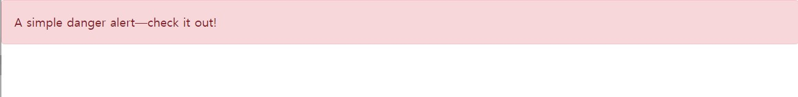

# Bootstrap
## Alert
[Bootstrap> components> Alerts](https://getbootstrap.com/docs/5.1/components/alerts/)

```html
<div class="alert alert-danger" role="alert">
  A simple danger alert—check it out!
</div>
```


보통 경고창을 띄우면 스크립트를 사용한다.
```html
<script>
    window.alert('javascript alert 창');
</script>
```

Bootstrap에서도 Modal을 지원해주지만,
alert 메세지를 실제로 bootstrap UI로 만들 수 있다.

[Sweet alert](https://sweetalert2.github.io/)를 사용한다.
***