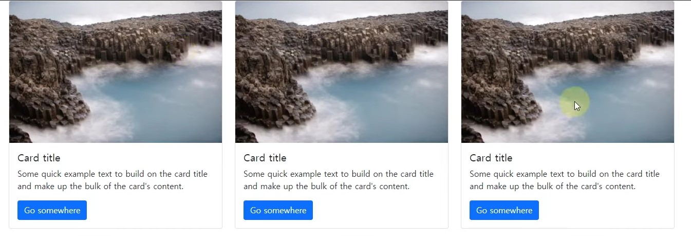

# Bootstrap
## Card
[Bootstrap> components> Card](https://getbootstrap.com/docs/5.1/components/card/)

정말 많이 사용하는 것 중 하나
```html
<div class="container">
  <div class="row">
    <div class="col-md-4">
      <div class="card" style="width: 100%">
        
        <div class="card-body">
          <h5 class="card-title">Card title</h5>
          <p class="card-text">Some quick example text to build on the card title and make up the bulk of the card's
            content.</p>
          <a href="#" class="btn btn-primary">Go somewhere</a>
        </div>
      </div>
    </div>
    <div class="col-md-4">
      <div class="card" style="width: 100%">
        
        <div class="card-body">
          <h5 class="card-title">Card title</h5>
          <p class="card-text">Some quick example text to build on the card title and make up the bulk of the card's
            content.</p>
          <a href="#" class="btn btn-primary">Go somewhere</a>
        </div>
      </div>
    </div>
    <div class="col-md-4">
      <div class="card" style="width: 100%">
        
        <div class="card-body">
          <h5 class="card-title">Card title</h5>
          <p class="card-text">Some quick example text to build on the card title and make up the bulk of the card's
            content.</p>
          <a href="#" class="btn btn-primary">Go somewhere</a>
        </div>
      </div>
    </div>
  </div>
</div>
```


<Br/><br/>

## Carousel
[Bootstrap> components> Carousel](https://getbootstrap.com/docs/5.1/components/carousel/)

이미지가 옆으로 넘어가는 것
```html
<div id="carouselExampleControls" class="carousel slide" data-bs-ride="carousel">
  <div class="carousel-inner">
    <div class="carousel-item active">
      
    </div>
    <div class="carousel-item">
      
    </div>
    <div class="carousel-item">
      
    </div>
  </div>
  <button class="carousel-control-prev" type="button" data-bs-target="#carouselExampleControls" data-bs-slide="prev">
    <span class="carousel-control-prev-icon" aria-hidden="true"></span>
    <span class="visually-hidden">Previous</span>
  </button>
  <button class="carousel-control-next" type="button" data-bs-target="#carouselExampleControls" data-bs-slide="next">
    <span class="carousel-control-next-icon" aria-hidden="true"></span>
    <span class="visually-hidden">Next</span>
  </button>
</div>
```
***