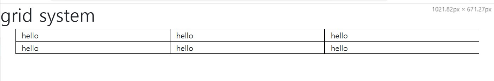

# Bootstrap
## Grid 시스템
[Bootstrap> layout> Grid system](https://getbootstrap.com/docs/5.1/layout/grid/)

홈페이지 전체가 12개의 column으로 구성되어 있다.<br/>
div.container로 감싸고 그 안에 div.row>div.col이 존재한다.
12개가 4개로 나눠서 3개의 column을 할당 받는다.
```html
<div class="container">
  <div class="row">
    <div class="col">
      Column
    </div>
    <div class="col">
      Column
    </div>
    <div class="col">
      Column
    </div>
  </div>
</div>
```

### Options
#### column
숫자를 붙여서 사용할 수도 있다.<br/>
`sm`, `md`, `lg` 이 세 가지를 가장 많이 사용한다.
||sm<br/>≥576px|md<br/>≥768px|lg<br/>≥992px
---|---|---|---
container<br/>(max-width)|540px|720px|960px

보통 하나의 주제를 하나의 `container`에 담는다.<br/>
grid를 생성하면 보통 여백이 존재한다.

```html
<body>
  <div class="container">
    <div class="row">
      <div class="col-md-4">hello</div>
      <div class="col-md-4">hello</div>
      <div class="col-md-4">hello</div>
    </div>
  </div>
</body>
```

12개의 column을 4개씩 할당받았다.

개발자 도구을 열어서 너비를 768px로 줄이면 변화가 일어난다.<br/>
4개의 column을 차지한 div block이 아래 일렬로 보인다.

<br/>
<br/>

하나의 `container`안에 여러 개의 row가 존재할 수 있다.

```html
<body>
  <div class="container">
    <div class="row">
      <div class="col-md-4">hello</div>
      <div class="col-md-4">hello</div>
      <div class="col-md-4">hello</div>
    </div>
    <div class="row">
      <div class="col-md-4">hello</div>
      <div class="col-md-4">hello</div>
      <div class="col-md-4">hello</div>
   </div>
  </div>
</body>
```


만약 하나의 row안에 12개의 초과하는 column을 작성하면,
12개가 초과하는 순간부터 다음 row에 표시가 된다.
```html
<body>
  <div class="container">
    <div class="row">
      <div class="col-md-4">hello</div>
      <div class="col-md-4">hello</div>
      <div class="col-md-4">hello</div>
      <div class="col-md-4">hello</div>
      <div class="col-md-4">hello</div>
      <div class="col-md-4">hello</div>
   </div>
  </div>
</body>
```
<br/>
<br/>

칸을 비우고 싶으면 class에 offset을 사용한다.<br/>
`offset-md-4`를 사용하면 4개의 block을 지우게 된다.
```html
<body>
  <div class="container">
    <div class="row">
      <div class="col-md-4 offset-md-4">hello</div>
      <div class="col-md-4">hello</div>
   </div>
  </div>
</body>
```

<br/>
<br/>

#### 여백 없애기
```html
<div class="container-fluid">
```

<br/>
<br/>

#### 크기 조절
만약 처음에 6, 3, 3으로 했다가 column이 줄어듦에 따라 small-size가 됐을 때는 1, 1, 1이 아니라 6, 6, 12으로 보여지고 싶다.
```html
<body>
  <div class="container-fluid">
    <div class="row">
      <div class="col-md-4 col-sm-6">hello</div>
      <div class="col-md-4 col-sm-6">hello</div>
      <div class="col-md-4 col-sm-12">hello</div>
    </div>
  </div>
</body>
```

medium-size에서 small-size로 변경되는 너비인 **768px** 이하가 되면<br/>
column이 아래 일렬로 정렬되지 않고 위 이미지와 같이 보인다.

576px 이하가 되면 하나의 block으로 보인다.
***