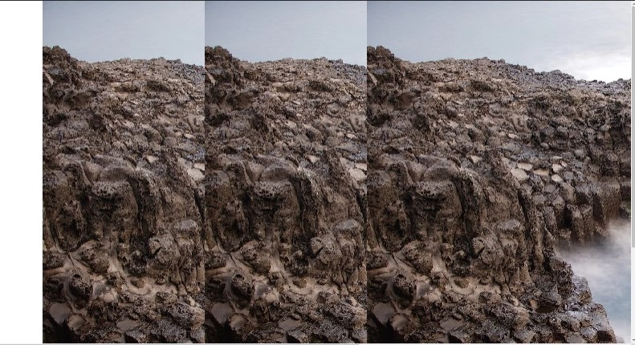
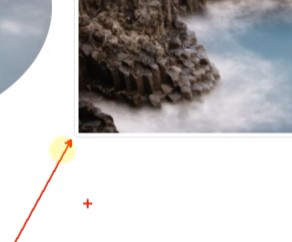

# Bootstrap
## 이미지
[Bootstrap> content> Images](https://getbootstrap.com/docs/5.1/content/images/)

```html
<div class="container">
    <div class="row">
      <div class="col-md-4">
        
      </div>
      <div class="col-md-4">
        
      </div>
      <div class="col-md-4">
        
      </div>
    </div>
  </div>
```

이미지가 커서 옆 영역을 침범하면 겹쳐서 화면에 출력된다.
이 때, class를 줘서 해결한다.
<br/>

#### `class="img-fluid"` : 너비에 따라서 움직여라.

column에 맞게 들어간 것을 볼 수 있다.
<br/>

#### `class="img-fluid rounded"` : 모서리가 둥글어진다.

<br/>

#### `class="img-fluid rounded-circle"` : 이미지가 원으로 바뀐다.

현재 이미지가 정사각형이 아니기때문에 타원형으로 보인다.
<br/>

#### `class="img-fluid img-thumbnail"` : 이미지 주위에 액자처럼 선이 생긴다.

***