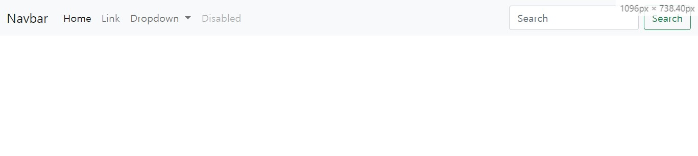
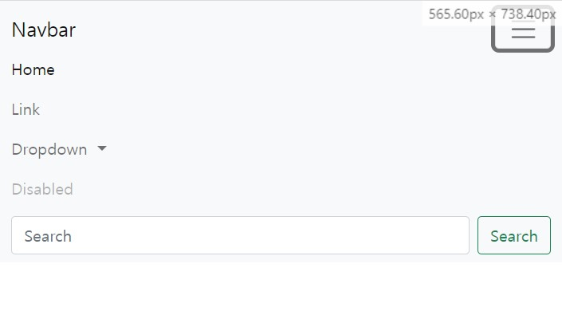

# Bootstrap
## Navbar
[Bootstrap> components> Navbar](https://getbootstrap.com/docs/5.1/components/navbar/)

원하는 Navbar 코드를 복사해서 사용한다.
```html
<nav class="navbar navbar-expand-lg navbar-light bg-light">
  <div class="container-fluid">
    <a class="navbar-brand" href="#">Navbar</a>
    <button class="navbar-toggler" type="button" data-bs-toggle="collapse" data-bs-target="#navbarSupportedContent" aria-controls="navbarSupportedContent" aria-expanded="false" aria-label="Toggle navigation">
      <span class="navbar-toggler-icon"></span>
    </button>
    <div class="collapse navbar-collapse" id="navbarSupportedContent">
      <ul class="navbar-nav me-auto mb-2 mb-lg-0">
        <li class="nav-item">
          <a class="nav-link active" aria-current="page" href="#">Home</a>
        </li>
        <li class="nav-item">
          <a class="nav-link" href="#">Link</a>
        </li>
        <li class="nav-item dropdown">
          <a class="nav-link dropdown-toggle" href="#" id="navbarDropdown" role="button" data-bs-toggle="dropdown" aria-expanded="false">
            Dropdown
          </a>
          <ul class="dropdown-menu" aria-labelledby="navbarDropdown">
            <li><a class="dropdown-item" href="#">Action</a></li>
            <li><a class="dropdown-item" href="#">Another action</a></li>
            <li><hr class="dropdown-divider"></li>
            <li><a class="dropdown-item" href="#">Something else here</a></li>
          </ul>
        </li>
        <li class="nav-item">
          <a class="nav-link disabled">Disabled</a>
        </li>
      </ul>
      <form class="d-flex">
        <input class="form-control me-2" type="search" placeholder="Search" aria-label="Search">
        <button class="btn btn-outline-success" type="submit">Search</button>
      </form>
    </div>
  </div>
</nav>
```


화면의 크기가 작아지면 다음과 같이 보인다.

<br/>
<br/>

example에 있는 마음에 드는 부분의 코드를 가져오면 사용할 수 있다. (같은 CSS를 사용하고 있으니까.)
***