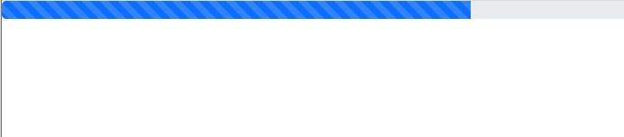

# Bootstrap
## Progress
[Bootstrap> components> Progress](https://getbootstrap.com/docs/5.1/components/progress/)

진행의 정도를 알 수 있는 UI<br/>
애니메이션도 적용할 수 있다.
```html
<div class="progress">
    <div class="progress-bar progress-bar-striped progress-bar-animated" role="progressbar" aria-valuenow="75" aria-valuemin="0" aria-valuemax="100" style="width: 75%"></div>
</div>
```

***