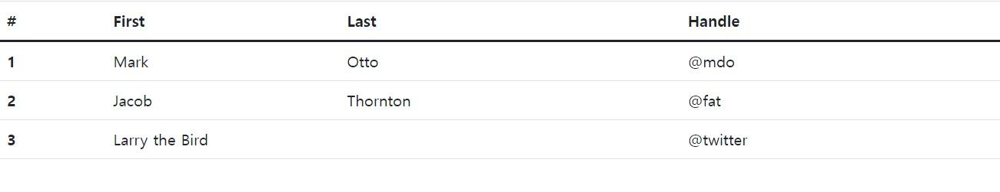

# Bootstrap
## Table
[Bootstrap> content> Images](https://getbootstrap.com/docs/5.1/content/tables/)

```html
<table class="table">
  <thead>
    <tr>
      <th scope="col">#</th>
      <th scope="col">First</th>
      <th scope="col">Last</th>
      <th scope="col">Handle</th>
    </tr>
  </thead>
  <tbody>
    <tr>
      <th scope="row">1</th>
      <td>Mark</td>
      <td>Otto</td>
      <td>@mdo</td>
    </tr>
    <tr>
      <th scope="row">2</th>
      <td>Jacob</td>
      <td>Thornton</td>
      <td>@fat</td>
    </tr>
    <tr>
      <th scope="row">3</th>
      <td colspan="2">Larry the Bird</td>
      <td>@twitter</td>
    </tr>
  </tbody>
</table>
```

위 코드에서 `<table>`에 `class="table"`을 지우면 선들이 사라진다.
<br/>

#### `class="table-striped"`
table ROW에 회색이 입혀진다.

#### `class="table-hover"`
table ROW에마우스 hover하면 회색이 생긴다.
***