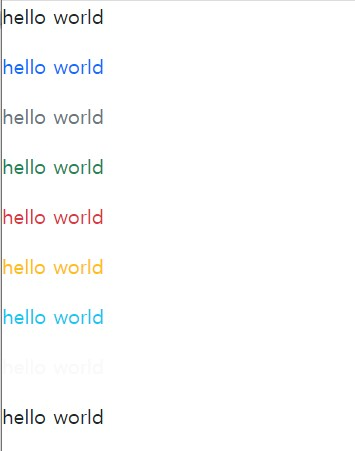

# Bootstrap
## Text
[Bootstrap> customize> Color](https://getbootstrap.com/docs/5.1/customize/color/)

Bootstrap에서 지정한 color들을 사용하는 것을 권장한다.
```html
<body>
  <p class="text-active">hello world</p>
  <p class="text-primary">hello world</p>
  <p class="text-secondary">hello world</p>
  <p class="text-success">hello world</p>
  <p class="text-danger">hello world</p>
  <p class="text-warning">hello world</p>
  <p class="text-info">hello world</p>
  <p class="text-light">hello world</p>
  <p class="text-dark">hello world</p>
</body>
```

`class="primary"`라고 작성하면 텍스트에 색이 적용되지않는다.<br/>
background 등 style은 `primary`를 적용할 수 있지만 text는 꼭 `text-`를 붙여줘야 한다.

## Button
[Bootstrap> components> Buttons](https://getbootstrap.com/docs/5.1/components/buttons/)

```html
<body>
  <button type="button" class="btn btn-primary">Primary</button>
  <button type="button" class="btn btn-secondary">Secondary</button>
  <button type="button" class="btn btn-success">Success</button>
  <button type="button" class="btn btn-danger">Danger</button>
  <button type="button" class="btn btn-warning">Warning</button>
  <button type="button" class="btn btn-info">Info</button>
  <button type="button" class="btn btn-light">Light</button>
  <button type="button" class="btn btn-dark">Dark</button>
  <button type="button" class="btn btn-link">Link</button>
</body>
```
button도 style을 지정하려면 `btn-`를 붙여줘야 한다.
***