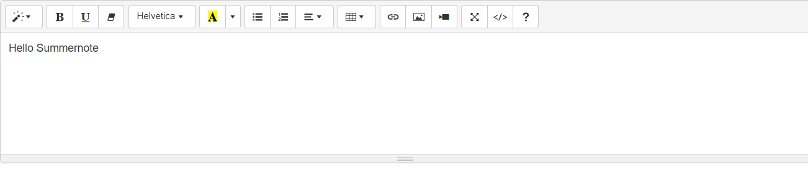

# Bootstrap
## Textarea
[TOAST UI](https://ui.toast.com/)<Br/>
[Summernote](https://summernote.org/)

```html
<textarea name="" id="" cols="30" rows="10"></textarea>
```
이질적인 느낌이 든다.

#### Summernote 사용하기
다운받아서 사용할 수도 있지만
```html
<!DOCTYPE html>
<html lang="en">
<head>
  <meta charset="UTF-8">
  <title>Summernote</title>
  <!-- include libraries(jQuery, bootstrap) -->
  <link href="https://stackpath.bootstrapcdn.com/bootstrap/3.4.1/css/bootstrap.min.css" rel="stylesheet">
  <script src="https://code.jquery.com/jquery-3.5.1.min.js"></script>
  <script src="https://stackpath.bootstrapcdn.com/bootstrap/3.4.1/js/bootstrap.min.js"></script>
  <!-- include summernote css/js -->
  <link href="https://cdn.jsdelivr.net/npm/summernote@0.8.18/dist/summernote.min.css" rel="stylesheet">
  <script src="https://cdn.jsdelivr.net/npm/summernote@0.8.18/dist/summernote.min.js"></script>
</head>
<body>
  <div id="summernote"><p>Hello Summernote</p></div>
  <script>
    $(document).ready(function() {
        $('#summernote').summernote();
    });
  </script>
</body>
</html>
```

***