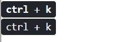

# Bootstrap
## 타이포그래피
[Bootstrap> content> Typography](https://getbootstrap.com/docs/5.1/content/typography/)

### Display headings
```html
<body>
  <h1>hello world</h1>
  <h1 class="display-1">hello world</h1>
</body>
```

display가 좀 더 큰 크기를 가진다.

`<div>`나 `<p>`에 `class="h1"`을 줘서 사용하지 않는다.
<br/>
<Br/>

### 키보드
```html
<kbd> <kbd>ctrl</kbd> + <kbd> k </kbd></kbd><br>
<kbd> ctrl +  k </kbd><br>
```

두 개의 bold가 다르다.
***