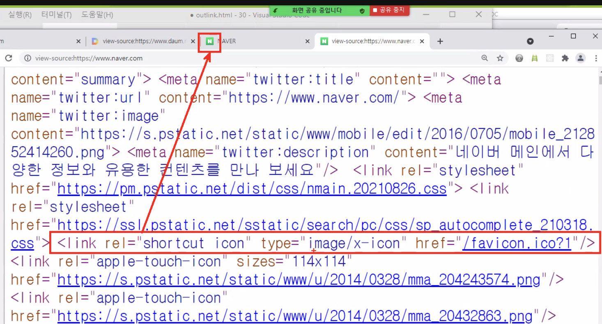

# favicon
작성일시: 2021년 8월 27일 오후 5:23

favicon 확장자는 반드시 ico 이며
png 파일을 ico로 바꿔서 적용한다.

적용방법) 
index.html 있는 위치에 ico 파일을 추가하고 
`<link rel="shortout.ico" ~~~ >` 코드를 적용한다. 

=> 확인하려면 FTP로 index.html, ico 파일을 올려놓고 웹상에서 확인한다.