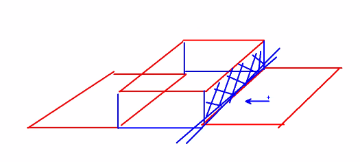

# float
작성일시: 2021년 9월 6일 오후 5:38

> **float**

1. 수직 구조의 요소를 수평 구조로 변경<br/>
   -크기와 위치를 조정할 수 있는 요소에 적용<br/>
     -> Block 요소

2. 요소의 레벨이 inline-block 형식으로 변경<br/>
   -요소레벨을 강제로 바꾸는구나

3. 수평으로 나열될 모든 요소에 float 속성 적용

4. none / left / right

5. 선택된 요소를 위로 띄우는 속성

6. 위로 이동하면서 생긴 빈 자리에 다른 요소가 이동

7. 자식 요소의 길이합이 부모 요소의 길이보다 길면<br/>
   부모 요소의 길이를 초과하는 요소들이 아래쪽으로 이동<br/>
   (태그 작성 순)

8. 형제와 부모 관계의 요소들끼리만 적용

---

> **clear**
1. float 속성 해제
2. left / right / both

---

```html
<!DOCTYPE html>
<html lang="ko">

<head>
  <meta charset="UTF-8">
  <meta http-equiv="X-UA-Compatible" content="IE=edge">
  <meta name="viewport" content="width=device-width, initial-scale=1.0">
  <title>float</title>
  <style type="text/css">
    #header {
      width: 800px;
      height: 150px;
      background: #e68829;
      margin: auto;
    }

    #lnb {
      width: 200px;
      height: 300px;
      background: #399de6;
      float: left;
    }

    #content {
      width: 600px;
      height: 300px;
      background: #e040d4;
      float: left;
    }

    #footer {
      width: 1000px;
      height: 150px;
      background: #76d34c;
      /* float: left; */
      clear: both;
      margin: auto;
    }

    #main {
      margin: auto;
      width: 800px;
    }
  </style>
</head>

<body>
  <div id="header"></div>
  <div id="main">
    <div id="lnb"></div>
    <div id="content"></div>
  </div>
  <div id="footer"></div>
</body>

</html>
```

**float이 아닌 clear를 쓰는 이유**

1. float된 content뒤의 content가 이동하지 않음



*clear의 개념:  float으로 생긴 빈공간을 막아서 그 다음 컨텐츠가 이동하지 않음*

2. float된 content의 width 합이 전체 width를 넘어가면 넘어간 content는 아래로 내려옴
3. margin: auto를 사용하기 위해. (float을 사용하면 margin: auto 사용 못함)
<Br/>
<Br/>
<aside>
💡 **⭐적용 우선순위⭐**<br/>

```
position: absolute / fixed > float > margin: auto (+width, position: relative)

- position의 absolute와 fixed는
  float보다 우선수위가 높고,
                                    - margin: auto는 반드시 width랑 같이 써야 하고
                                      position이 필요하다면 relative를 쓸 수 있다.
```

</aside>

---

> **웹 페이지가 가변형 높이를 가지는 방법**

1. 빈 박스를 추가한다.

**`.clearfix {clear: both;}`**

추가하는 위치는 float되는 요소의 맨 끝에 추가한다.<Br/>
이는 브라우저 버전이나 종류 상관없이 사용 가능하지만 불필요한 태그를 추가해야되기에 사용하지 않는다.

```html
<!DOCTYPE html>
<html lang="ko">

<head>
  <meta charset="UTF-8">
  <meta http-equiv="X-UA-Compatible" content="IE=edge">
  <meta name="viewport" content="width=device-width, initial-scale=1.0">
  <title>float</title>
  <style type="text/css">
    #header {
      width: 800px;
      height: 150px;
      background: #e68829;
      margin: auto;
    }

    #lnb {
      width: 200px;
      height: 300px;
      background: #399de6;
      float: left;
    }

    #content {
      width: 600px;
      height: 400px;
      background: #e040d4;
      float: left;
    }

    #footer {
      width: 1000px;
      height: 150px;
      background: #76d34c;
      margin: auto;
    }

    #main {
      margin: auto;
      width: 800px;
      background: #aaa;
    }

    .clearfix {
      clear: both;
    }
  </style>
</head>

<body>
  <div id="header"></div>
  <div id="main">
    <div id="lnb"></div>
    <div id="content">
      <p>1</p>
      <p>1</p>
      <p>1</p>
      <p>1</p>
      <p>1</p>
    </div>
    <div class="clearfix"></div>
  </div>
  <div id="footer"></div>
</body>

</html>
```
<br/>

2. 가상의 태그를 추가한다.

**`#name:after {content: " "}`**

```html
<!DOCTYPE html>
<html lang="ko">

<head>
  <meta charset="UTF-8">
  <meta http-equiv="X-UA-Compatible" content="IE=edge">
  <meta name="viewport" content="width=device-width, initial-scale=1.0">
  <title>float</title>
  <style type="text/css">
    #header {
      width: 800px;
      height: 150px;
      background: #e68829;
      margin: auto;
    }

    #lnb {
      width: 200px;
      height: 300px;
      background: #399de6;
      float: left;
    }

    #content {
      width: 600px;
      height: 400px;
      background: #e040d4;
      float: left;
    }

    #footer {
      width: 1000px;
      height: 150px;
      background: #76d34c;
      margin: auto;
    }

    #main {
      margin: auto;
      width: 800px;
      background: #aaa;
    }

    #main:after {
      content: " ";
      display: block;
      clear: both;
    }
  </style>
</head>

<body>
  <div id="header"></div>
  <div id="main">
    <div id="lnb"></div>
    <div id="content">
      <!-- <p>1</p>
      <p>1</p>
      <p>1</p>
      <p>1</p>
      <p>1</p> -->
    </div>
  </div>
  <div id="footer"></div>
</body>

</html>
```

<br/>

3. `overflow: hidden` 사용

 (조건)<br/>
 3-1. 반드시 자식요소가 float 상태<br/>
 3-2. 부모요소에는 height 사용 안함

  사용하게되면 float된 아이들 높이를 읽으라는 뜻이 됨.
```html
<!DOCTYPE html>
<html lang="ko">

<head>
  <meta charset="UTF-8">
  <meta http-equiv="X-UA-Compatible" content="IE=edge">
  <meta name="viewport" content="width=device-width, initial-scale=1.0">
  <title>float</title>
  <style type="text/css">
    #header {
      width: 800px;
      height: 150px;
      background: #e68829;
      margin: auto;
    }

    #lnb {
      width: 200px;
      height: 300px;
      background: #399de6;
      float: left;
    }

    #content {
      width: 600px;
      height: 400px;
      background: #e040d4;
      float: left;
    }

    #footer {
      width: 1000px;
      height: 150px;
      background: #76d34c;
      margin: auto;
    }

    #main {
      margin: auto;
      width: 800px;
      background: #aaa;
      overflow: hidden;
    }
  </style>
</head>

<body>
  <div id="header"></div>
  <div id="main">
    <div id="lnb"></div>
    <div id="content">
      <!-- <p>1</p>
      <p>1</p>
      <p>1</p>
      <p>1</p>
      <p>1</p> -->
    </div>
  </div>
  <div id="footer"></div>
</body>

</html>
```