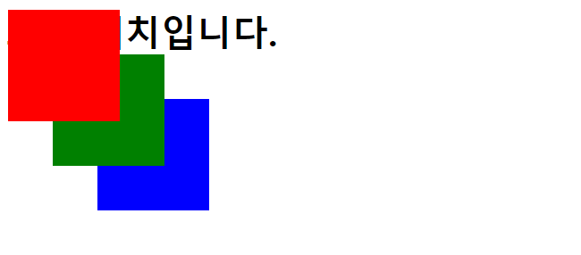

# 위치 속성(1)
작성일시: 2021년 8월 9일 오후 11:56

> **Position** 속성

- **static**<br/>
  일반적인 문서 흐름에 따라 배치 (기본)
- **relative**<br/>
  기준 위치를 선택한 요소로 변경
- **absolute**<br/>
  문서(static) 또는 부모(relative) 기준 절대 위치 좌표 설정
- **fixed**<br/>
  화면을 기준으로 절대 위치 좌표 설정

```css
body {
      height: 2000px;
    }

.box {
      width: 100px;
      height: 100px;
      /* 문서 또는 부모 요소의 기준 절대 위치 */
      /* 기본 태그 위치 */
      position: absolute;
    }

.red {
      background-color: red;
      left: 10px;
      top: 10px;
    }

.green {
      background-color: green;
      left: 50px;
      top: 50px;
    }

.blue {
      background-color: blue;
      left: 90px;
      top: 90px;
    }
```


position: absolute; 결과<br/>
body 기준으로 left, top 값만큼 떨어져 위치
스크롤 움직이면 사라짐
<br/>
<br/>

```css
body {
      height: 2000px;
      margin: 0;
    }

.box {
      width: 100px;
      height: 100px;
      /* 창 기준 절대 위치 */
      position: fixed;
    }

.red {
      background-color: red;
      /* 왼쪽부터 좌표 */
      left: 10px;
      /* 위에서부터 좌표 */
      top: 10px;
    }

.green {
      background-color: green;
      left: 50px;
      top: 50px;
    }

.blue {
      background-color: blue;
      left: 90px;
      top: 90px;
    }
```

```css
body {
      height: 2000px;
    }

.wrapper {
      /* 부모요소에 relative를 걸면 자식의 absolute는 부모 기준으로 시작 */
      position: relative;
      border: 1px solid black;
      /* 자식 요소가 absolute이면 컨텐츠 높이가 사라짐 */
      /* 별도로 높이값을 주어야함 */
      height: 300px;
    }

.box {
      width: 100px;
      height: 100px;
      /* 문서 또는 부모 요소의 기준 절대 위치 */
      /* 기본 태그 위치 */
      position: absolute;
    }

.red {
      background-color: red;
      left: 10px;
      top: 10px;
    }

.green {
      background-color: green;
      left: 50px;
      top: 50px;
    }

.blue {
      background-color: blue;
      left: 90px;
      top: 90px;
    }
```


(부모) wrapper의 postion: relatvie;<br/>
(자식) .box의 position: absolute;<br/>
부모위치 기준으로 자식위치가 left, top 값만큼 위치함

---

> **z-index**<br/>
  요소의 z축 값을 변경
  가장 위에 있어야하는 경우에는 큰 값을 입력한다 ex) 9999
>

```css
body {
      height: 2000px;
    }

.box {
      width: 100px;
      height: 100px;
      /* 문서 또는 부모 요소의 기준 절대 위치 */
      /* 기본 태그 위치 */
      position: absolute;
    }

.red {
      background-color: red;
      /* 왼쪽부터 좌표 */
      left: 10px;
      /* 위에서부터 좌표 */
      top: 10px;
      /* 크기가 클수록 위에서 보임 */
      z-index: 100;
    }

.green {
      background-color: green;
      left: 50px;
      top: 50px;
      z-index: 10;
    }

.blue {
      background-color: blue;
      left: 90px;
      top: 90px;
      z-index: 1;
    }
```



위와 달리 빨간 상자가 가장 위에 있다.

---