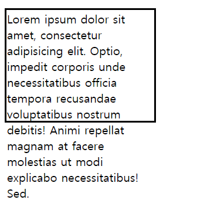
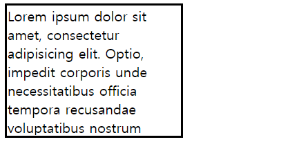
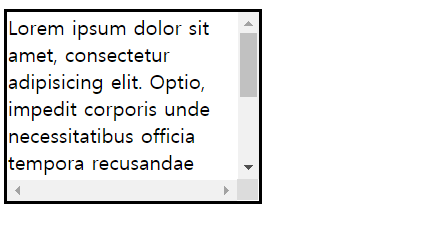
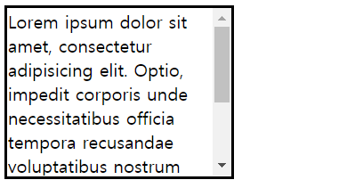
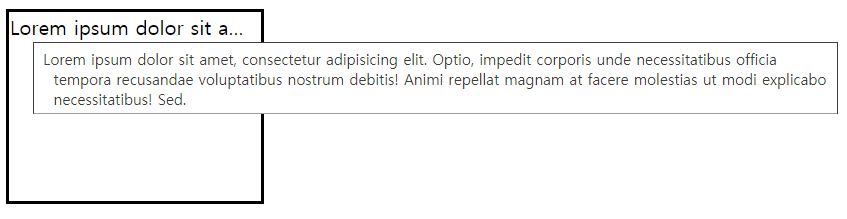

# 위치 속성(2)
작성일시: 2021년 8월 10일 오전 12:18

> **overflow**<br/>
  내부의 요소가 부모의 범위를 벗어날 때 어떻게 처리할 지 지정

- **overflow: hidden;**<br/>
  영역을 벗어나는 부분을 안 보이게 함
- **overflow: scroll;**<br/>
  영역을 벗어나는 부분을 스크롤로 만듦

```css
p {
      width: 200px;
      height: 150px;
      border: 3px solid black;
      margin-bottom: 100px;
    }
```



기본 형태

```css
p:nth-child(1) {
      /* 컨텐트 크기가 요소 크기보다 크면 숨김 */
      overflow: hidden;
    }
```



칸을 벗어나는 내용이 보이지 않음

```css
p:nth-child(2) {
      /* 컨텐트 크기가 요소 크기보다 크면 스크롤 생성 */
      overflow: scroll;
    }
```



내용이 벗어나자 scroll이 생성됨 (x, y축)

```css
p:nth-child(3) {
      /* 컨텐트 크기가 요소 크기보다 크면 스크롤 생성 */
      overflow-y: scroll;
    }
```



y축에만 scroll 생성

```css
p:nth-child(4) {
      /* 컨텐트 크기가 요소 크기보다 크면 스크롤 생성 */
      overflow-y: auto;
    }
```


y축 scroll 자동

```css
p:nth-child(5) {
      /* 단어(빈공간) 단위로 밑으로 꺽어서 내리지 않음 */
      white-space: nowrap;
      overflow: hidden;
      text-overflow: ellipsis;
    }
```



`<p title="">`을 사용하여 콘텐츠의 내용이 보임

---