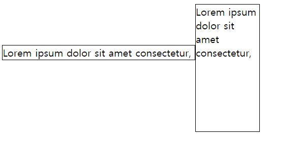

# display 속성
작성일시: 2021년 8월 10일 오전 12:52

> **display**<br/><br/>
  **none**: 태그를 화면에서 보이지 않게 함
>

```html
<html lang="ko">

<head>
  <meta charset="utf-8">
  <style>
    #box {
      /* 화면에서 안 보임 */
      display: none;
    }
  </style>
</head>

<body>
  <span onclick="showBox()">Show</span>
  <div id="box">
    Lorem ipsum dolor sit amet consectetur adipisicing elit. Non sit magnam consequuntur, animi quasi vero tempora sed
    illo porro dolorum sequi id, iusto odio assumenda vel ullam! Perspiciatis, facere a.
  </div>
  <script>
    function showBox() {
      //vanilla javascript
      document.querySelector("#box").style.display = "block";
      //jquery
      //$("#box").show();
    }
  </script>
</body>

</html>
```
예제 4-9.html 참고
웹페이지에서 show를 클릭하면 div의 내용이 보임
<Br/><br/>

> **display**<br/><br/>
  **inline**: 왼쪽에서 오른쪽으로 표시<br/>
  **inline-block: inline:** 표시방식이지만 크기를 지정할 수 있다.
>

```css
.box {
      width: 100px;
      height: 200px;
      border: 1px solid black;
    }

 .box:nth-child(1) {
      /* inline 형식은 너비/높이를 지정할 수 없음 */
      display: inline;
    }

 .box:nth-child(2) {
      /* inline과 같이 옆으로 붙음 */
      /* block과 같이 너비/높이를 지정할 수 있다. */
      display: inline-block;
    }
```



---