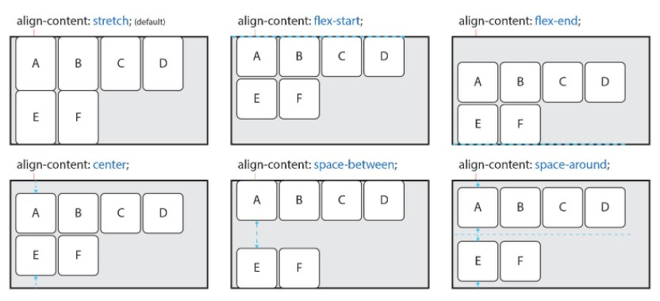
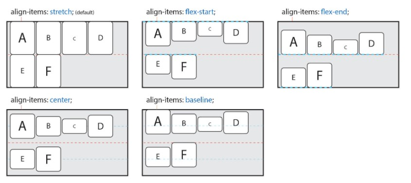
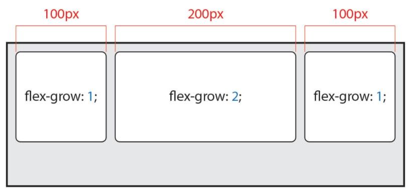
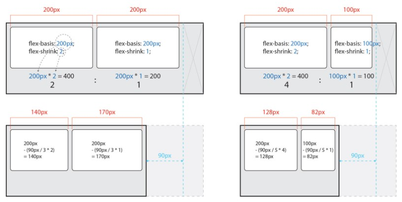
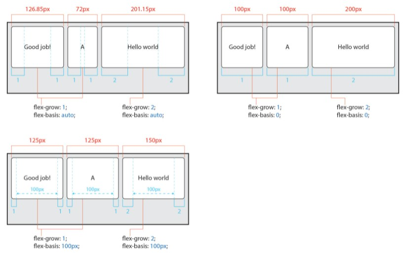

# Flex

여러 개의 아이템을 수평/수직으로 정렬할 때<BR/>
박스를 동일한 간격과 사이즈로 배치할 때 사용하는 것 => `flexbox`
```html
<div class="box-container">
  <div class="box"></div>
  <div class="box"></div>
  <div class="box"></div>
</div>
```
```css
.box-container {
  display: flex;
}
```
수평이 될 요소들의 `container`에 적용한다.
<br/>
<br/>

## Container

Items를 감싸는 부모 요소이며, 각 Item을 정렬하기 위해선 Container가 필수이다.

> 사용 속성
### 1. display
Flex container 정의
- flex
  Block 요소와 같은 성향(수직 쌓임) 가진다.
- inlind-flex
  Inline(Inline Block) 요소와 같은 성향(수평 쌓임)을 가진다.

  **items가 아닌 container에 대한 !!**

### 2. flex-flow
flex-direction와 flex-wrap의 단축 속성
```css
.flex-container {
  flex-flow: row-reverse wrap;
}
```

### 3. flex-direction
Flex Items의 주 축(main-axis)을 설정
- row *(default)*
  items 수평축(왼->오) 표시
- row-reverse
  items row반대 축으로 표시
- column
  items 수진축(위->아래) 표시
- column-reverse
  items column반대 축으로 표시

### 4. flex-wrap
Flex Items의 여러 줄 묶음(줄 바꿈) 설정
- nowrap *(default)*
  items 한 줄에 표시
- wrap
  items 여러 줄로 묶음
- wrap-reverse
  items wrap의 역방향으로 여러 줄 묶음

### 5. justify-content
주 축(main-axis)의 정렬 방법을 설정
- flex-start *(default)*
  Items를 시작점(flex-start) 정렬
- flex-end
  Items를 끝점(flex-end) 정렬
- center
  Items를 가운데 정렬
- space-between
  시작 Item은 시작점에, 마지막 Item은 끝점에 정렬되고<Br/>
  나머지 Items는 사이에 고르게 정렬됨
- space-around
  items를 균등한 여백을 포함하여 정렬

### 6. align-content
교차 축(cross-axis)의 정렬 방법을 설정(2줄 이상)<br/>
**flex-wrap 속성을 통해 Items가 여러 줄(2줄 이상)이고 여백이 있을 경우만 사용 가능**
- stretch *(default)*
  Container의 교차 축을 채우기 위해 Items를 늘린다.
- flex-start
  Items를 시작점(flex-start)으로 정렬
- flex-end
  Items를 끝점(flex-end)으로 정렬
- center
  Items를 가운데 정렬
- space-between
  시작 Item은 시작점에, 마지막 Item은 끝점에 정렬되고 나머지 Items는 사이에 정렬
- space-around
  Items를 균등한 여백을 포함하여 정렬



### 6. align-items
교차 축(cross-axis)에서 Items의 정렬 방법을 설정(1줄)

flex-wrap을 통해 여러 줄(2줄 이상)일 경우에는 <u>align-content 속성이 우선적용된다.</u><br/>
따라서 align-items를 사용하려면 align-content 속성을 기본값(stretch)으로 설정해야 한다.

- stretch	*(default)*
Container의 교차 축을 채우기 위해 Items를 늘린다.
- flex-start
  Items를 각 줄의 시작점(flex-start)으로 정렬
- flex-end
  Items를 각 줄의 끝점(flex-end)으로 정렬
- center
  Items를 가운데 정렬
- baseline
  Items를 문자 기준선에 정렬


<Br/>
<br/>

## Items

> 사용 속성
### 1. align-self
교차 축(cross-axis)에서 Item의 정렬 방법 설정

- auto *(default)*
  Container의 align-items 속성을 상속받는다.
- stretch
  Container의 교차 축을 채우기 위해 Item을 늘림
- flex-start
  Item을 각 줄의 시작점(flex-start)으로 정렬
- flex-end
  Item을 각 줄의 끝점(flex-end)으로 정렬
- center
  Item을 가운데 정렬
- baseline
  Item을 문자 기준선에 정렬

### 2. flex
flex-grow, flex-shrink, flex-basis의 단축 속성
```css
.item {
  flex: 1 1 20px;   /* 증가너비 감소너비 기본너비 */
  flex: 1 1;        /* 증가너비 감소너비 */
  flex: 1 20px;     /* 증가너비 기본너비 (단위를 사용하면 flex-basis가 적용) */
}
```
flex-grow를 제외한 개별 속성은 생략할 수 있다.

### 3. flex-grow
Flex Item의 증가 너비 비율 설정<br/>
- 0 *(default)*
```
예를 들어 Item이 3개이고 증가 너비가 각각 1, 2, 1이라면,
첫 번째 Item은 총 너비의 25%(1/4)을,
두 번째 Item은 총 너비의 50%(2/4)를,
세 번째 Item은 총 너비의 25%(1/4)을 가진다.
```



### 4. flex-shrink
Flex Item의 감소 너비 비율 설정<br/>
- 0 *(default)*

요소의 너비에 영향을 받는다.(width, height, flex-basis 등으로 너비가 지정된 경우)
```
Container의 너비가 줄어 Item의 너비에 영향을 미치기 시작한 지점부터 실제 줄어든 거리가 90px일 때,
요소 너비가 다른 Item이 2개이고 요소 너비는 각각 200과 100이고,
지정된 감소 너비가 각각 2와 1이라면,
200 x 2 = 400과 100 x 1 = 100 즉 감소 너비는 4:1 비율이며,
첫 번째 Item은 90px의 4/5인 72px 만큼 너비가 감소하고,
두 번째 Item은 90px의 1/5인 18px 만큼 너비가 감소한다.
```



### 5. flex-basis
Flex Item의 (공간 배분 전) 기본 너비 설정
- auto *(default)*



### 6. order
Flex Item의 순서를 설정

Item에 숫자를 지정하고 숫자가 클수록 순서가 뒤로 밀린다.<br/>
음수가 허용된다.


***
### References
- [CSS Flex-box](https://shuchong.tistory.com/entry/CSS-Flexbox-%EB%B0%98%EC%9D%91%ED%98%95-%EC%9B%B9%EC%82%AC%EC%9D%B4%ED%8A%B8-%ED%95%84%EC%88%98-%EB%AF%B8%EB%94%94%EC%96%B4%EC%BF%BC%EB%A6%AC)
- [Guide to Flexbox](https://css-tricks.com/snippets/css/a-guide-to-flexbox/)
- [Flex item 방향과 순서](https://naradesign.github.io/flex-direction-order.html)
- [Flexbox layout](https://blog.stories.pe.kr/202)
- [Flex(Flexible Box)](https://heropy.blog/2018/11/24/css-flexible-box/)