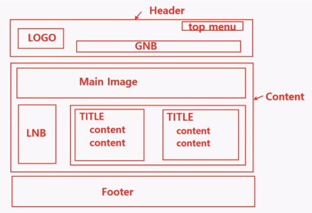
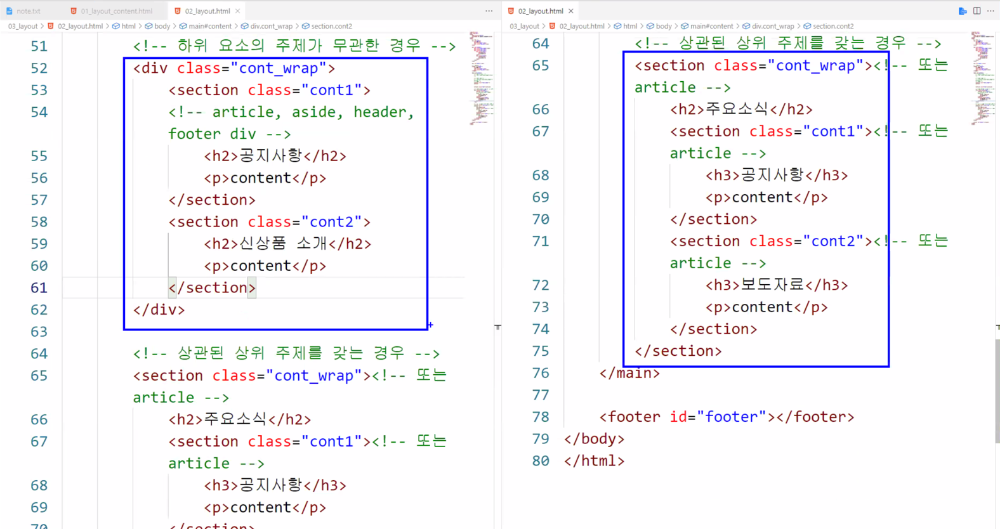

# Semantic tag
작성일시: 2021년 8월 24일 오후 4:33



해당 구조를 div와 시맨틱 태그로 표현했을 때

---

> **1. \<div\> 사용**
>

```html
<!DOCTYPE html>
<html lang="ko">
<head>
    <meta charset="UTF-8">
    <title>div VS semantic element</title>
</head>
<body>
    <!-- div -->
    <div id="header">
        <h1>LOGO</h1>
        <div class="gnb"></div>
        <div class="top_menu"></div>
    </div>

    <div id="content">
        <div class="main_image"></div>
        <div class="lnb"></div>
        <div class="cont_wrap">
            <div class="cont1">
                <h2>TITLE</h2>
                <p>content</p>
            </div>
            <div class="cont2">
                <h2>TITLE</h2>
                <p>content</p>
            </div>
        </div>
    </div>

    <div id="footer"></div>

</body>
</html>
```

---

> **2. Semantic tag 사용**
>

```html
<!DOCTYPE html>
<html lang="ko">
<head>
    <meta charset="UTF-8">
    <title>div VS semantic element</title>
</head>
<body>
	  <!-- semantic -->
    <header id="header">
        <h1>LOGO</h1>
        <nav class="gnb"></nav>
        <div class="top_menu"></div>
    </header>

    <main id="content">
        <!-- 비주얼 이미지 -->
        <!-- <div class="main_image"></div> -->

        <!-- 정보 포함 -->
        <!-- <article class="main_image"></article> -->
        <!-- 또는 -->
        <section class="main_image"></section>

        <article class="lnb"></article>

        <!-- 하위 요소의 주제가 무관한 경우 -->
        <div class="cont_wrap">
            <section class="cont1">
            <!-- article, aside, header, footer div -->
                <h2>공지사항</h2>
                <p>content</p>
            </section>
            <section class="cont2">
                <h2>신상품 소개</h2>
                <p>content</p>
            </section>
        </div>

        <!-- 상관된 상위 주제를 갖는 경우 -->
        <section class="cont_wrap"><!-- 또는 article -->
            <h2>주요소식</h2>
            <section class="cont1"><!-- 또는 article -->
                <h3>공지사항</h3>
                <p>content</p>
            </section>
            <section class="cont2"><!-- 또는 article -->
                <h3>보도자료</h3>
                <p>content</p>
            </section>
        </section>
    </main>

    <footer id="footer"></footer>
</body>
</html>
```

```html
<header id="header">
        <h1>LOGO</h1>
        <nav class="gnb"></nav>
        <div class="top_menu"></div>
</header>
```

<aside>

💡 `<header>` : 머릿글<br/>
 - 내부에 `<header>`, `<footer>`, `<section>`, `<article>` 사용할 수 없다.

'top menu'를 나타낼 적절한 태그가 없으면 `<div>`를 사용한다.

</aside>

```html
<main id="content">
        <!-- 비주얼 이미지 -->
        <!-- <div class="main_image"></div> -->

        <!-- 정보 포함 -->
        <!-- <article class="main_image"></article> -->
        <!-- 또는 -->
        <section class="main_image"></section>

        <article class="lnb"></article>
```

<aside>

💡 `<main>` : 페이지의 주요 내용
 - `<article>`, `<section>` 내부에 존재할 수 없다.

내용이 중요한 정보를 포함하냐/안 하냐에 따라 사용할 semantic tag를 결정한다.

단순 비주얼을 위한 이미지라면, `<div>` <br/>
정보를 포함한다면, `<article>`, `<section>`

`<h1>`, `<main>`, `<nav>`, `<address>`는 한 페이지에 한 번씩만<br/>사용하는 태그이므로 'LNB'에는 `<article>`을 사용한다.<br/>
(특정 페이지에서만 보여지는 내용은 `<section>`<br/>
 /다른 페이지에서도 볼 수 있는 독립적인 콘텐츠는 `<article>`)

</aside>

```html
        <!-- 하위 요소의 주제가 무관한 경우 -->
        <div class="cont_wrap">
            <section class="cont1">
            <!-- article, aside, header, footer div -->
                <h2>공지사항</h2>
                <p>content</p>
            </section>
            <section class="cont2">
                <h2>신상품 소개</h2>
                <p>content</p>
            </section>
        </div>
    </main>

    <footer id="footer"></footer>
</body>
</html>
```

<aside>

💡 **구성된 content가 서로 무관한 경우,**
`<div>`로 크게 묶고, 그 내부에서 `<section>`, `<article>`, `<aside>`, `<header>`, `<footer>`, `<div>`뭘 쓰든 상관없다.

</aside>

```html
        <!-- 상관된 상위 주제를 갖는 경우 -->
        <section class="cont_wrap"><!-- 또는 article -->
            <h2>주요소식</h2>
            <section class="cont1"><!-- 또는 article -->
                <h3>공지사항</h3>
                <p>content</p>
            </section>
            <section class="cont2"><!-- 또는 article -->
                <h3>보도자료</h3>
                <p>content</p>
            </section>
        </section>
    </main>

    <footer id="footer"></footer>
</body>
</html>
```

<aside>

💡 **구성된 content를 큰 주제로 묶을 수 있는 경우,**
`<section>`이나 `<article>`로 크게 묶고, 그 내부에서 `<section>` 또는 `<article>`로 구분한다.

상위 개념, 하위 개념이 존재하기 때문에 그에 따라 제목의 레벨도 맞춰준다.

</aside>



content의 관계에 따라 사용하는 semantice tag가 달라진다.

---

> **Semantic tag를 사용하는 이유**

웹 페이지를 보는 사용자들은 semantic tag가 없어도 표현 형태를 보고 내용을 구분할 수 있음

그러나, 장치들은 이를 구분하지 못하기 때문에 정확하게 이해하지 못하고
사용자에게 내용을 정확하게 전달할 수 없다.

---