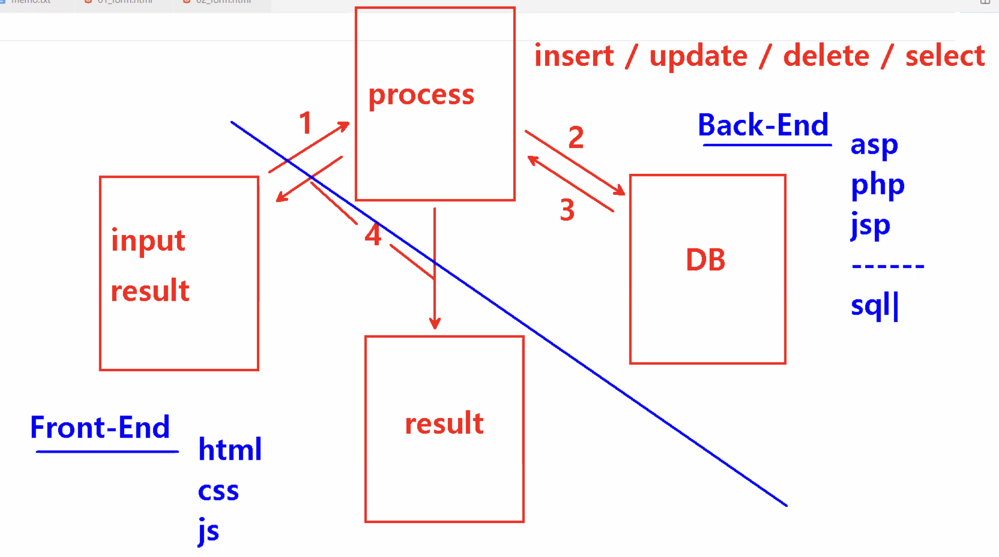
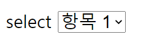
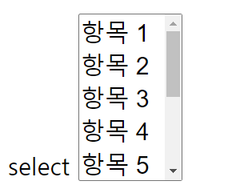
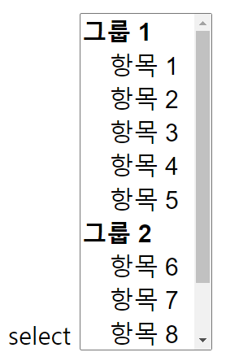
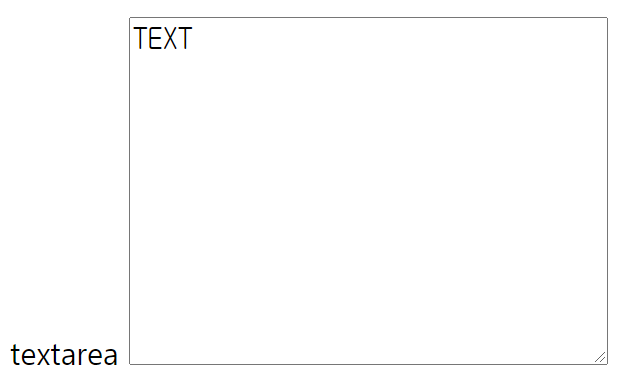

# `<form>`
작성일시: 2021년 8월 25일 오후 1:16


초반에는 사용자가 작성한 input 데이터를 DB에 바로 저장했다.<br/>
그러자 모든 사람들이 접근할 수 있는 보안상의 문제가 발생했고,<br/>
데이터를 처리하는 process가 생겨났다.

**사용자 input date → process → DB에 처리해줘 요청(inset/update/delete/select)
 → 처리한 data를 process에 전달 → 결과물 도출(input에 표현될 수도 있음)**



**Front-End** : 사용자 눈에 보이는 부분  //input, result<br/>
- 원래의 의미, 사용자에게 보여지는 부분을 편리하게 사용하도록 만드는 것인데<br/>
                      이는 곧 UX와 연결되어 의미가 달라지게 된다.
- 현재의 의미, Back-End 언어로 Back-End에서 해야할 일을 Front-End 언어로 개발하는 것<br/>
  JAVASCRIPT로 개발한다.  /JS만으로 개발하기 어려워지자 Framework 생김.

**Back-End** : 사용자에게 보여지지 않는 부분  //process, DB<br/>
- asap. php, jsp, sql 사용

---

프론트엔드는 백엔드를 기반으로 하여 개발함.<br/>
웹 프로그래밍에서 `<Form>`은 꼭 필요함 -사용자가 페이지에 정보를 전달함

> **`<Form>`**
>

```html
** form **
  1. 모든 양식은 <form> ~ </form> 안에서 작성

  2. 모든 양식은 이름(name AND id) 입력
      <??? name="" id="">

  3. 대부분의 양식은 <input> 태그의 "type" 속성으로 정의
      <input type="종류 선언">

  4. <select>, <textarea>, <button>은 독립 태그   /이 외에는 <input> 혼자 만든다.
      <select>
        <option> ~ </option>   /value를 써서 전송할 값 입력
        <option> ~ </option>   /처음부터 선택된 상태이고 싶으면 해당 option에 selected 입력
      </select>

      <textarea rows=" " cols=" "> </textarea>

      <button type=" ">TEXT</button>
```

```html
<form name="" action="데이터를 처리할 페이지 경로" method="데이터 전송방식">
```

- name : 여러 개의 `<form>`을 구분하기 위하여 사용하고, 한 페이지에서 여러 번 사용할 수 있다.<br/>
            지금은 다른 방법이 있어서 잘 사용하지 않음.
- action : 데이터를 처리할 페이지 경로<br/>
             `<form>`마다 페이지 경로가 다르므로, 여러 개의 `<form>`이 생김 →구분?
- method : 데이터 전송 방식 (input → process)<br/>
    1. get : 입력한 데이터를 포함하여 전달하는 방식<br/>
                장점 - 빠르다.<br/>
                단점 - 다른사람들도 볼 수 있어 보안이 약하다.
    2. post : 입력한 데이터를 암호화하여 전달하는 방식<br/>
                  장점 - 보안성이 높다.<br/>
                  단점 - 암호화→전송→복호화 과정이 있어 느리다.

---

> **`<select>`**
>

```html
<form name="" action="데이터를 처리할 페이지 경로" method="데이터 전송방식">
    <p>select
      <select name="" id="">
        <option value="" checked>항목 1</option>
        <option value="">항목 2</option>
        <option value="">항목 3</option>
        <option value="">항목 4</option>
      </select>
    </p>
</form>
```



위와 같이 옵션 선택 창이 생김

```html
<p>select
      <select name="" id="" size="5" multiple>
        <option value="">항목 1</option>
        <option value="">항목 2</option>
        <option value="">항목 3</option>
        <option value="">항목 4</option>
        <option value="">항목 5</option>
        <option value="">항목 6</option>
        <option value="">항목 7</option>
        <option value="">항목 8</option>
        <option value="">항목 9</option>
        <option value="">항목 10</option>
      </select>
</p>
```



`<select>`에 속성 'size'를 적용하면 multiple 속성을 사용할 수 있어서
다중 옵션 선택이 가능하다.

```html
<p>select
      <select name="" id="" size="10" multiple>
        <optgroup label="그룹 1">
          <option value="">항목 1</option>
          <option value="">항목 2</option>
          <option value="">항목 3</option>
          <option value="">항목 4</option>
          <option value="">항목 5</option>
        </optgroup>
        <optgroup label="그룹 2">
          <option value="">항목 6</option>
          <option value="">항목 7</option>
          <option value="">항목 8</option>
          <option value="">항목 9</option>
          <option value="">항목 10</option>
        </optgroup>
      </select>
</p>
```



`<optgroup>`을 사용하면 `<option>`을 그룹화하여 나타낼 수 있다.

> **`<textarea>`**
>

```html
<p>textarea
      <textarea name="" id="" cols="30" rows="10">TEXT</textarea>
</p>
```



`<textara>`는 여러 줄을 입력할 수 있는 창으로 한 줄 입력칸은 `<input>`으로 작성한다.
'cols'는 가로로 들어가는 글자 수, 'rows'는 창의 높이를 표시한다.

---