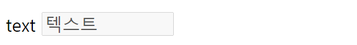
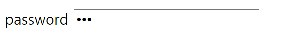
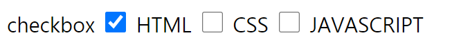
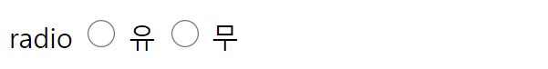
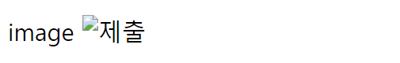
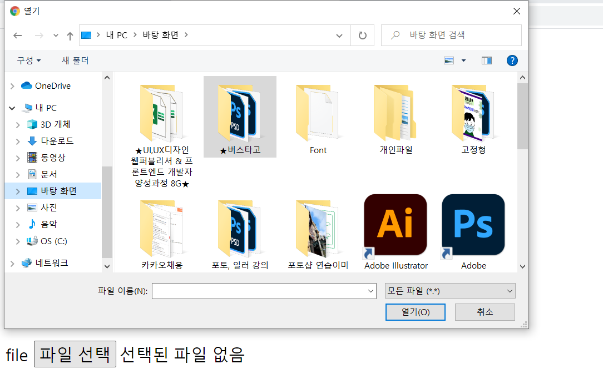
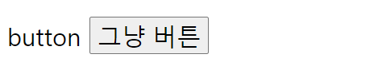
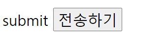
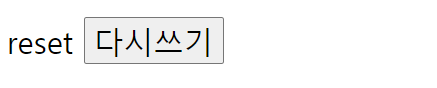

# `<input>` -1
작성일시: 2021년 8월 25일 오후 3:03

`<form>`안에서 `<input>`의 type 속성으로 양식을 작성한다.

> **`<input type=" ">`**
>
>*** type 속성**
>  1. text
>  2. password
>  3. checkbox
>  4. radio
>  5. image
>  6. file
>  7. hidden
>  8. button
>  9. submit
>  10. reset
>

> **1. text**
>

```html
1. text
  -value : 실제 글자로 입력창에 보여짐
        클릭하면 커서가 뒤로 가고, value 글자도 선택 가능함
  -placeholder : 실제 글자는 아니고 입력창에 보여짐
              클릭하면 커서가 앞에 있고, text를 입력하면 지워짐
  >>이 두 개를 같이 쓰면 value만 보이고 placeholder는 안 보임.

  -size : 입력창 길이 조절 (한 칸에 몇 글자가 보이게 할거야)
        실제로는 글자수가 조금 다르게 보여지고 있음

        실무에서는 잘 안 쓴다.
        왜? CSS에서 하면 되니까

  -maxlength : 최대 글자 수
              텍스트 작성 시 제한이 생김
  -minlength : 최소 글자 수
              전송 기능 실행했을 때 기능이 보임 -알림창(브라우저 지원)이 뜬다

  -readonly : 속성값을 쓰지 않아도 됨. (xhtml은 속성값이 있어야 됨, 값이 없는 속성들은 똑같이 속성 이름을 쓴다.)
              JS이용해서 글자를 쓸 순 있음.
              드래그하게 만들 수 있지만 쓸 수 없음. 읽기만 가능함
  -disabled : 속성값을 쓰지 않아도 됨. (xhtml은 속성값이 있어야 됨, 값이 없는 속성들은 똑같이 속성 이름을 쓴다.)
              사용하면 입력창에 회색 배경이 생김.

  readonly vs disabled
  >>이 두 개를 같이 쓸 수 없음
        readonly는 안에 있는 텍스트가 전송되지만,
        disabled는 안에 있는 텍스트가 전송 안 됨.

  ex) 게시판에서 공개/비공개 설정할 때 비밀번호 입력칸 유무
        공개일 때는 비밀번호 전달 안되게, 비공개일 때는 비밀번호 사용

        공개일 때 비밀번호가 입력이 되도 전송이 되지 않게 -> disabled
```

```html
<p>text
      <input type="text" name="" id="" value="텍스트" placeholder="아이디" size="10" maxlength="10" minlength="4" readonly="readonly" disabled="disabled">
</p>
```



> **2. password**
>

```html
2. password
  -text와 동일한 속성이나 보이는게 특수문자

  -value : 이것도 특수문자로 보임
  -placeholder : 글자가 보이지만 직접 입력하면 특수문자로 보임
```

```html
<p>password
      <input type="password" name="" id="" value="아이디">
</p>
```



> **3. checkbox**
>

```html
3. checkbox
  -다중선택 가능
  -checkbox 옆에 글자는 설명하기 위한 글자로 서로 상관없는 관계임 (전송되는 글자x)

  -value : check 했을 때 실제로 전달할 값

  -checked : 미리 check되어 처음부터 보임
```

```html
<p>checkbox
  <input type="checkbox" name="" id="" value="A" checked> HTML
  <input type="checkbox" name="" id="" value="B"> CSS
  <input type="checkbox" name="" id="" value="C"> JAVASCRIPT
</p>
```



> **4. radio**
>

```html
4. radio
  -단일선택
  -radio 옆에 글자는 설명하기 위한 글자로 서로 상관없는 관계임 (전송되는 글자x)
  -이름(name)이 같은 것 중에서 하나만 선택하는 것
  name=""라 해도 브라우저에서 name1, name2 부여해서 다른 이름으로 인지함 -> 다중선택 됨

  -checked : 미리 check되어 처음부터 보임
```

```html
<p>radio
  <input type="radio" name="a" id="" value=""> 유
  <input type="radio" name="a" id="" value=""> 무
</p>
```



> **5. image**
>

```html
5. image
  -하는 일은 submit이지만 사용법은 
  -CSS를 활용하기 전에 사용하던 방식
```

```html
<p>image
  <input type="image" name="" id="" src="" alt="">
</p>
```



> **6. file**
>

```html
6. file
  -파일 선택 기능
```

```html
<p>file
  <input type="file" name="" id="">
</p>
```



> **7. hidden**
>

```html
7. hidden
  -text와 동일하지만 화면에 보이지 않는 text 입력창을 쓸 때 사용
  -그 화면에 담겨있어야하는 정보이기는 하나 사용자에게 보여줄 필요는 없는 정보들을 담아둘 때 사용

  -보이지 않는 정보? 공지사항에서 로그인을 하고나서 공지사항창으로 돌아갈 때
                    이전 페이지에 대한 정보를 알아야 돌아간다.
                    하지만 이를 사용자에게 보여줄 필요는 없다.
```

```html
<p>hidden
  <input type="hidden" name="" id="">
</p>
```


내용이 보이지 않음

> **8. button**
>

```html
8. button
  -아무 기능 없음
  -따라서, 어떤 기능이든 연결할 수 있기 때문에 가장 많이 사용함.

  -value : 버튼 이름 정의
```

```html
<p>button
  <input type="button" name="" id="" value="그냥 버튼">
  <!-- 이제 input으로 안하고 <button>으로 작성 -->

  <button type="button">그냥 버튼</button>
</p>
```



> **9. submit**
>

```html
9. submit
  -전송기능이 있음
  -<form>안에서 사용자가 입력한 정보들은 submit 버튼을 눌렀을 때, method 방식으로 action의 page에 전송이 됨.

  -value : 버튼 이름 정의
```

```html
<p>submit
  <input type="submit" name="" id="" value="전송하기">
  <!-- 이제 input으로 안하고 <button>으로 작성 -->

  <button type="submit">전송하기</button>
</p>
```



> **10. reset**
>

```html
10. reset
  -<form>안에 입력한 정보들을 처음 상태로 되돌릴 때 사용 (전송x)
```

```html
<p>reset
  <input type="reset" name="" id="" value="다시쓰기">
  <!-- 이제 input으로 안하고 <button>으로 작성 -->

  <button type="reset">다시쓰기</button>
</p>
```



---

<aside>

💡 8. 9. 10.은 이제 사용하지 않고 `<button>` 으로 만든다.
 >`<button>`으로 작성하고 cSS를 활용해서 이미지처럼 보이게 할 수 있다. <br/>
이런 의도로 CSS 활용하기 전에 나온게 `<input type="image">`

</aside>

***