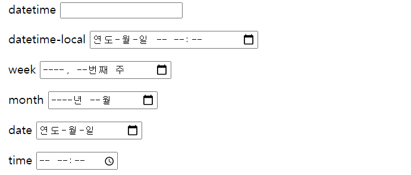
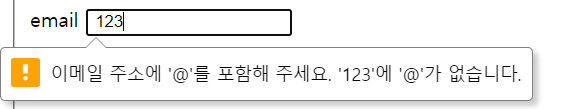
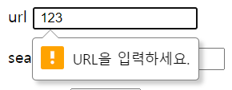
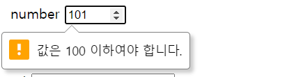
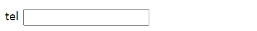
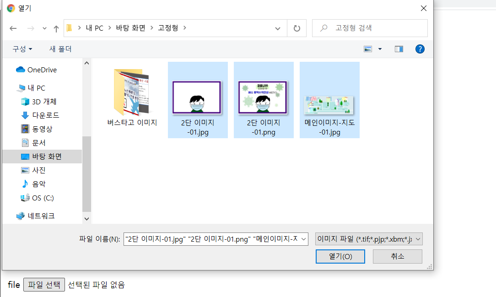

# `<input>`-2
작성일시: 2021년 8월 26일 오후 4:48

> (HTML5에서) 추가된 type 속성값
>1. 날짜 관련 type
>     -datetime
>     -week
>     -month
>     -date
>     -time
> 2. email
> 3. url
> 4. search
> 5. number
> 6. range
> 7. tel
> 8. file
>

---

> **1. 날짜 관련 type**
>

```html
1. 날짜 관련 type
   -datetime
    <input type="datetime">
    <input type="datetime-local">

   -week
    <input type="week">

   -month
    <input type="month">

   -date
    <input type="date">

   -time
    input type="time">
```

```html
<p>datetime
  <input type="datetime">
</p>

<p>datetime-local
  <input type="datetime-local">
</p>

<p>week
  <input type="week">
</p>

<p>month
  <input type="month">
</p>

<p>date
  <input type="date">
</p>
```



세부 옵션들은 해당 브라우저가 지원해준다.

---

> **2. email**
>

```html
2. email
   <input type="email">
```

```html
<p>email
  <input type="email">
</p>
```



e-mail 형식을 인지하기 때문에 알림창이 뜬다

---

> **3. url**
>

```html
3. url
   <input type="url">
   -작성할 때는 http:// 부터 쓴다.
```

```html
<p>url
  <input type="url">
</p>
```



작성은 http:// ~

---

> **4. search**
>

```html
4. search
   <input type="search">

   -(tmi) explore 하위 버전에서는 모든 text 입력창에 'x'가 생김

      ex) Daum 페이지 소스
          input::-ms-clear{display:none}

          vendor prefix : 브라우저별 접두어  //-ms-
```

```html
<p>search
  <input type="search">
</p>
```


---

> **5. number**
>

```html
5. number
   <input type="number" min="1" max="100">
```

```html
<p>number
  <input type="number" min="1" max="100">
</p>
```



min, max 범위의 숫자만 유효하다.

---

> **6. range**
>

```html
6. range
  <input type="range" min="0" max="100" step="10" value="0">
```

```html
<p>range
  <input type="range" min="0" max="100" step="10" value="0">
</p>
```


---

> **7. tel**
>

```html
7. tel
   <input type="tel">
```

```html
<p>tel
  <input type="tel">
</p>
```



---

> **8. file**
>

```html
8. file
   <input type="file" accept="image/*" multiple>

   -옛날에는 이미지 파일만 선택 가능하게 만들려면,

    JS이용해서 파일명을 거꾸로 읽어 '.'만날 때 까지,
    그 글자가 jpg,..랑 똑같아? 판단시킴

   -지금은 accept를 이용해서 특정 파일만 볼 수 있게 됨.

   -multiple을 추가해서 여러 개의 파일 선택 가능하다.
```

```html
<p>file
  <input type="file" accept="image/*" multiple>
</p>
```



---