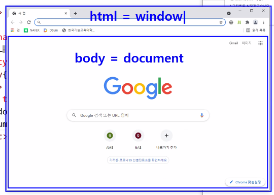

# Script 개요 및 적용
작성일시: 2021년 8월 10일 오전 10:58

## Intro

컴퓨터의 역할은 크게 2가지

1. **Client**<br/>
: 어떤 정보를 요청하거나(request) 요청한 정보를 받는 컴퓨터<br/>
  **CSL**(Client Side Language) - html, css, js     ← 소스보기하면 다 나옴.
2. **Server**<br/>
: 요청받은 정보를 응답(response)해주는 컴퓨터<br/>
  **SSL**(Server Side Language) - php, asp, jsp   ← 절대 liveserver 이런거 안됨.

  php 확인 방법 <br/>
  : 저장하고 FTP 업로드 하고, 업로드한 파일주소 접속해서 확인한다.

---

# Javascript

1. 웹 브라우저에서 읽고 실행되는 언어 (CSL)
2. 소스보기하면 다 나오기 때문에 보안성이 없다.
3. HTML 내에 작성하기 때문에 절대 단독으로 사용할 수 없다.
4. HTML과는 달리 대소문자 구분이 엄격하다.<br/>
(css에서도 대소문자 구분을 하지 않지만, .class_name에서는 구분한다.)
5. HTML과 동일하게 한 줄 씩 차례대로 실행된다.
6. Javascript에는 연산 능력이 있다.

---

### 구조 비교

1. html<br/>
`<element attribute="value">`
2. css<br/>
`selector {property:value}`
3. javascript<br/>
`object.property="value"`<br/>
'.'  스크립트에서 조사('이', '가', '에' etc) 역할


    

    html = window (하지만 html보단 window가 크다.)<br/>
    body = document (하지만 body보단 document가 크다.)


---

> **주석처리**
1. `//` : 한 줄 주석
2. `/* */` : 여러 줄 주석
<br/>
<br/>

> **적용방법 2가지**

1. 내부 스크립트<br/>
HTML 문서 내에 작성한다.<br/>
`<script type="text/javascript">스크립트 효과 작성</script>`
```html
<script type="text/javascript">
    window.alert("스크립트를 실행하였습니다.");
    document.write("이 문장을 출력합니다.");
</script>
```


2. 외부 스크립트<br/>
외부 파일로 작성 "name.js"해서 불러온다.<br/>
`<script type="text/javascript" src="name.js"> </script>`

```html
<script type="text/javascript" src="js/hello.js">
    document.write("이 문장이 출력될까요?");
</script>

⭐외부 스크립트 태그 사이 내용은 출력되지 않는다.
```

```jsx
window.alert("외부에서 실행한 스크립트입니다.");
document.write("외부에서 출력한 문장입니다.");
```