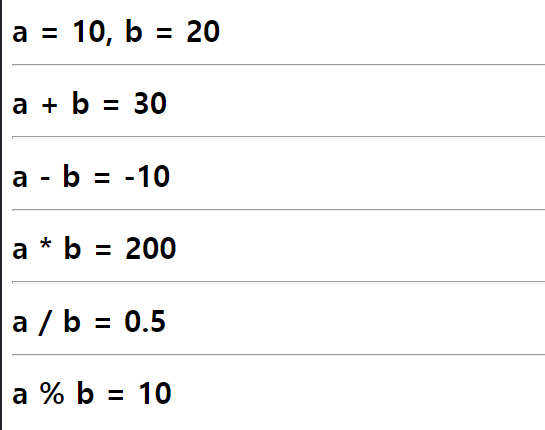
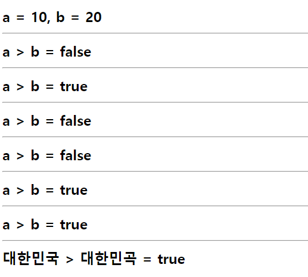
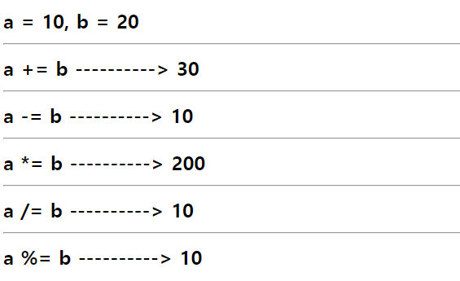

# 연산자
작성일시: 2021년 10월 6일 오후 1:44

## 산술 연산자

1. `+`   : 더하기
2. `-`    : 빼기
3. `*`    : 곱하기
4. `/`    : 나누기
5. `%`   : 두 수를 나눈 나머지

text는 string만 되고 number는 안되지만,<br/>
숫자는 string, number 둘다 가능하다.

```jsx
var a, b
a = 10;
b = 20;

// document.write(매개변수, 인자, parameter);
// 인자는 보통 하나이고, 인자가 없거나 여러개인 명령어도 있음.
// document.write는 인자 1개인 명령어

document.write("<h2>");
document.write("a = 10, b = 20");
document.write("<hr>");
document.write("a + b = " + (a + b));
document.write("<hr>");
document.write("a - b = " + (a - b));
document.write("<hr>")
//밑에 세 개는 애초에 +보다 우선순위가 없으니까 ()없어도 동일한 결과값이 나옴
document.write("a * b = " + (a * b));
document.write("<hr>");
document.write("a / b = " + (a / b));
document.write("<hr>");
document.write("a % b = " + (a % b));
document.write("</h2>")
```



웹 브라우저 실행 화면

위 스크립트에서 표현식에 괄호가 없다면,

`document.write("a + b = " + a + b);`<br/>
`"a+b="+10`의 결과값 종류는 `[문자]`이다.<br/>
 → 문자 더하기 숫자로 인식 (더하기보다는 연결의 의미로 이해)

`document.write("a - b = " + a - b);`<br/>
 → 문자에서 숫자를 뺄 수 없으니까 결과값은 NaN으로 출력

---

## 연결 연산자

1. `+` : 연산자의 좌변과 우변의 값이 산술연산이 불가할 경우,
       두 개의 값을 이어준다.

    ex) `1 + 2 = 3`      <-- 산술 연산이 가능하므로 "**산술** 연산자"<br/>
          `"a" + 1 = a1`  <-- 두 개의 값을 연결하는 "**연결** 연산자"


#### (참고용) 언어별 변수 선언 및 출력 방법

- **javascript**<br/>
    var score = "100";<br/>
    document.write(score + " POINT");<br/>
    --> 100 POINT

- **php**<br/>
    $score = 100;<br/>
    echo $score. " POINT"<br/>
    --> 100 POINT

- **asp**<br/>
    dim score<br/>
    response.write

- **c언어, java**<br/>
    int score (자료형을 쓰고 변수)<br/>
    print(f)


---

## 비교 연산자

결과값이 true / false로 출력

1. `>` : 크다
2. `<` : 작다
3. `==` : 같다 (비교의 의미)
4. `<=` : 작거나 같다
5. `>=` : 크거나 같다
6. `!=` : 다르다

<aside>

💡 `!`는 항상 앞에 쓰고 `=`는 항상 뒤에 쓴다.

</aside>

문자의 경우 abc, ㄱㄴㄷ순으로 앞쪽에 있을수록 숫자가 낮다.

```jsx
var a, b
a = 10;
b = 20;

document.write("<h2>");
document.write("a = 10, b = 20");
document.write("<hr>");
document.write("a > b = " + (a > b));
document.write("<hr>");
document.write("a > b = " + (a < b));
document.write("<hr>");
document.write("a > b = " + (a == b));
document.write("<hr>");
document.write("a > b = " + (a >= b));
document.write("<hr>");
document.write("a > b = " + (a <= b));
document.write("<hr>");
document.write("a > b = " + (a != b));
document.write("<hr>");
document.write("대한민국 > 대한민곡 = " + ("대한민국" > "대한민곡"))
document.write("</h2>");
```



---

## 논리 연산자

좌변과 우변의 식을 검토하여 결과를 산출한다.<br/>
좌변, 우변의 data가 Boolean형이거나, Boolean형이 도출되는 식일 때.

1. `&&` (and) : 좌변과 우변의 식이 모두 true인 경우에 true 반환
2. `||` (or)  : 좌변과 우변의 식 중 하나라도 true이면 true 반환
3. `^` (Xor)  : 좌변과 우변 중 하나만 true이 경우 true 반환 (실무에서 사용안함)
4. `!` (not) : 반대 값 반환

| |TT| TF|FT|FF
|---|---|---|---|---
`&&` |T |F |F |F
`ll` |T |T |T |F

## 비트식 연산자

논리연산자와 같은 연산자이지만 연산기호가 1개이다.

값은 1(true), 0(false)로 출력

1. `&`
2. `|`

---

## 대입 연산자

1. = 기호가 들어간 연산식
2. 좌변과 우변에 동일식이 존재하는 경우 약식 가능하다.

    a = a + b   ---------->  a += b<br/>
    a = a - b    ---------->  a -= b<br/>
    a = a * b    ---------->  a *= b<br/>
    a = a / b    ---------->  a /= b<br/>
    a = a % b   ---------->  a %= b<br/>


```jsx
var a, b
a = 10;
b = 20;

document.write("<h2>");
document.write("a = 10, b = 20");
document.write("<hr />");
document.write("a += b ----------> " + (a += b));
document.write("<hr />");
document.write("a -= b ----------> " + (a -= b));
document.write("<hr />");
document.write("a *= b ----------> " + (a *= b));
document.write("<hr />");
document.write("a /= b ----------> " + (a /= b));
document.write("<hr />");
document.write("a %= b ----------> " + (a %= b));
document.write("</h2>");
```



**풀이_**
```
a += b 가 있으면, a = 10, b = 20 일 때
a = a + b
a = 10 + 20
a = 30 이고, 이는 다음 연산에서 사용되는 a 값이다.
```

<aside>
💡 스크립트 중간에 `a=10;` 을 재할당해주면 해당 값으로 연산 진행

</aside>

<aside>
💡 프로그래밍 언어에서 equal sign이 있으면 뒤에서부터 보도록 한다.

</aside>

---

## 증감 연산자

변수는 Number Object여야 한다.

1. 변수의 값을 증가 또는 감소시키는 연산자
2. 연산기호 : ++ , —
3. 증감범위 : +-1
4. 선행처리(++a), 후행처리(a++)

```
a = 100
	a++ : 100+1, 101+1, 102+1, ...
	++a : 101, 102, 103, ...

	a-- : 100-1, 99-1, 98-1, ...
    --a : 99, 98, 97, ...

_____________________________________________________________
a = 1
a++;    <--- a 값을 1 증가 시켜. (a = a + 1)로 표현할 수 있음.
=> a = 2
```
<Br/>

**증감연산자 vs 대입연산자**
  - a++ : 식이 짧지만 증감폭이 1로 제한적
  - a = a + 1 : 식이 길지만 증감폭 지정 가능

게시판에 글번호에 증감 연산자 사용함.

---

## 조건 연산자(삼항 연산자)

조건의 결과에 따라 다른 값 출력하기 때문에<br/>
똑같은 조건이라도 실행되는 문장에 따라서 결과가 다르다.(변수가 달라지면)

```
(조건) ?   조건이 참일 경우   :   조건이 거짓인 경우
```

```jsx
var a, b, rs1, rs2
a = "수요일";

// 변수는 실행되는 문장에서 봤을 때
// 자기보다 위쪽에 있으면서 가까운 곳에 있을 때 사용

rs1 = "오늘은 수요일 입니다.";
rs2 = "오늘은 수요일이 아닙니다.";

b = (a == "수요일") ? rs1 : rs2;
document.write("<h2>" + b + "</h2>");
// true이므로 b는 rs1값을 출력한다.

a = "일요일"
b = (a == "수요일") ? rs1 : rs2;
document.write("<h2>" + b + "</h2>");
// false이므로 b는 rs2값을 출력한다.
```

---