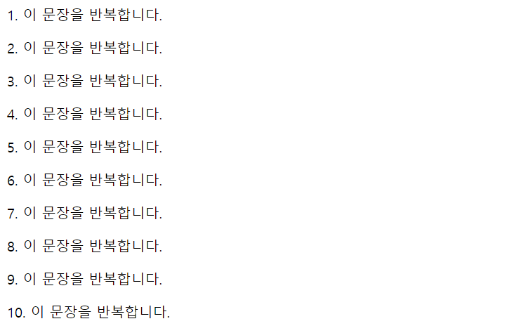
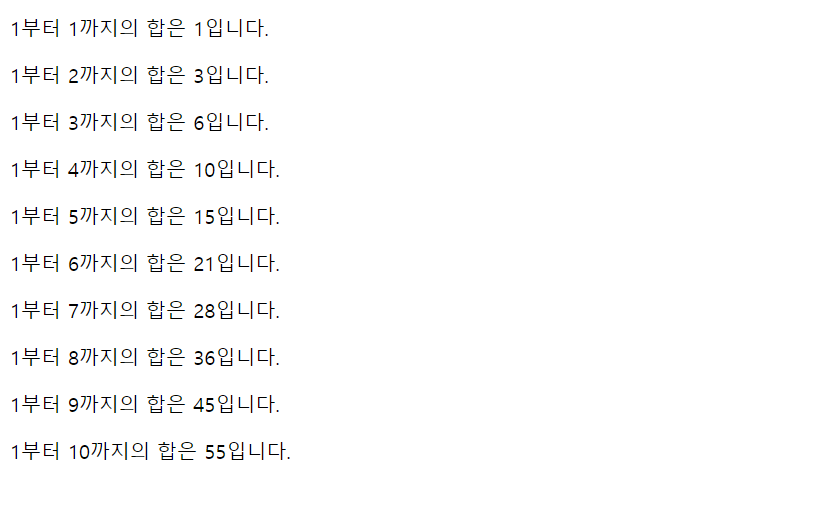
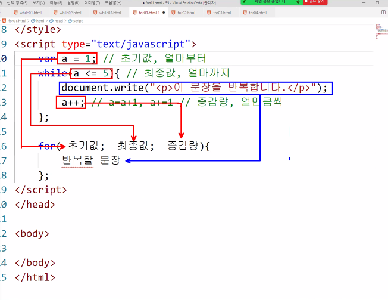
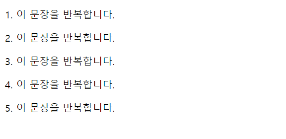
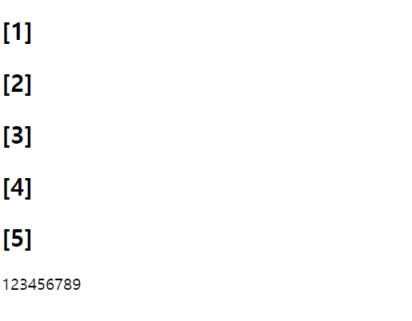
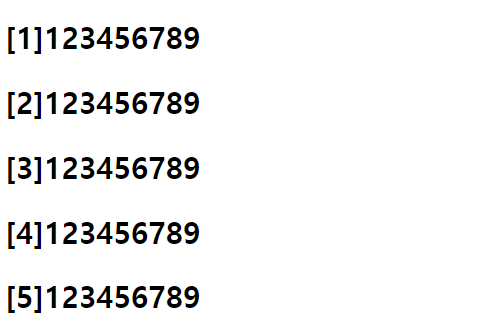
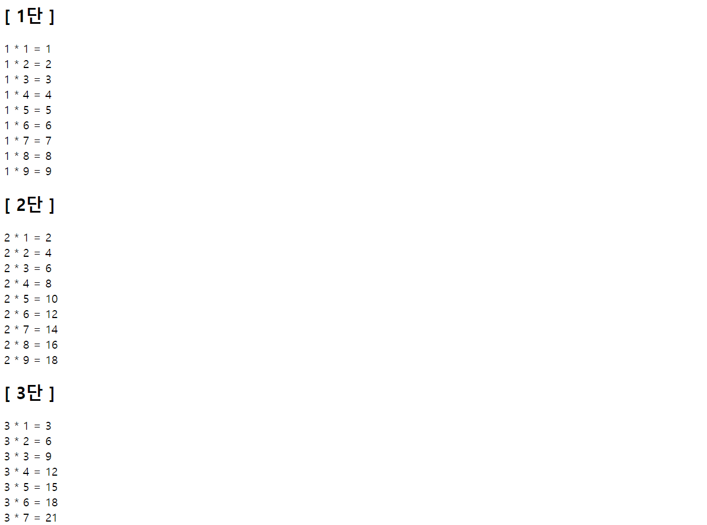

# 제어문(1)-반복문
작성일시: 2021년 10월 7일 오후 1:49

# Intro

**제어문**<br/>
해당 언어를 효율적으로 사용하기 위한 문장으로, 연산이 가능한 모든 언어에 존재한다.

---

## 반복문
규칙적으로 실행되는 문장을 직접 입력하지 않고 여러 번 실행시키는 문장

> **조건**<br/>
반복문은 반드시 조건이 필요하다.<br/>
조건을 입력하는 방법은 1) 배열, 2) 숫자범위 가 있다.
>

ex)<br/>
(1) 1 ~ 5 까지 있으면 몇번 반복할 수 있나?<br/>
      → 값이 바뀌는 양에 따라서 바뀔 수 있다.<br/>
            예) 1씩 바뀌면 5번, 2씩 바뀌면 3번<br/><br/>
(2) 1부터 1씩 바뀌면 몇번 반복할 수 있나?<br/>
      → 얼마까지 인지 명시안해서 바뀔 수 있다.<br/><br/>
(3) 10까지 1씩 바뀌면 몇번 반복할 수 있나?<br/>
      → 얼마부터 시작하는지 명시안해서 바뀔 수 있다.

<aside>
💡 (숫자범위)조건은 초기값, 최종값, 증감량이 필요하다.

</aside>

---

### while

1. 조건 + 반복문
2. `while(조건){
     조건이 참인 동안 반복할 문장
}`<br/>
조건이 거짓이라면 실행되지 않음.

```jsx
** 문장을 5번 반복하게 만들어라 **

// 0️⃣
document.write("<p>이 문장을 반복합니다.</p>");
document.write("<p>이 문장을 반복합니다.</p>");
document.write("<p>이 문장을 반복합니다.</p>");
document.write("<p>이 문장을 반복합니다.</p>");
document.write("<p>이 문장을 반복합니다.</p>");
```

```jsx
// 1️⃣
while (조건) {
   조건이 참인 동안 반복할 문장
};

while (a = 5) {
document.write("<p>이 문장을 반복합니다.</p>");
};
```

```jsx
// 2️⃣
while (a == 5) {
document.write("<p>이 문장을 반복합니다.</p>");
};
```

```jsx
// 3️⃣
var a = 1;
while (a == 5) {
   document.write("<p>이 문장을 반복합니다.</p>");
};
```

```jsx
// 4️⃣
var a = 1;
while (a <= 5) {
   document.write("<p>이 문장을 반복합니다.</p>");
}
```

```jsx
// 5️⃣
var a = 1;          // 초기값, 얼마부터
while (a <= 5) {    // 최종값, 얼마까지
   document.write("<p>이 문장을 반복합니다.</p>");
   a++;    //a=a+1, a+=1  //{}밖에 있으면 실행될 수 없음   // 증감량, 얼만큼씩
}
```

```jsx
// 6️⃣
var a = 1;
while (a <= 5) {
  document.write("<p>" + a + ". 이 문장을 반복합니다.</p>");
  a++;

  // 아래와 동일함.
  // document.write("<p>");
  // document.write(a);
  // document.write(". 이 문장을 반복합니다.</p>");
}
```



문장 반복 출력

> **1~10까지의 합 구하기**
>
>
> ```jsx
> 컴퓨터는 연산을 차례대로 진행함
> 0 + 1 = 1
> 1 + 2 = 3
> 3 + 3 = 6
> 6 + 4 =10
> a   b
>
> 변수 2개가 필요하다.
> 그리고 이전 연산의 값이 다음 연산 변수에 사용됨.
> a = a + b 가 반복되고 있었구나를 알 수 있음
> ```
>
> ```jsx
> var a = 0;    // 더해진 값, 다음 연산에 사용할 값
> var b = 1;    // 차례대로 증가할 값, 초기값
>
> while (b <= 10) {    //최종값
>   a = a + b;
>   b++;    //증감량
> };
> document.write("1부터 " + (b - 1) + "까지의 합은 " + a + "입니다.");
> ```
>
> 
>
> **다르게 표현하기**
>
> ```jsx
> var a = 0;    // 더해진 값, 다음 연산에 사용할 값
> var b = 1;    // 차례대로 증가할 값, 초기값
> var c = b;
>
> while (b <= 10) {    //최종값
>   a = a + b;
>   b++;               //증감량
>   document.write("<p>" + c + "부터 " + (b - 1) + "까지의 합은 " + a + "입니다.</p>");
> };
> ```
>
> 
>
> 출력 함수의 위치에 따라 반복과정이 나타나는지 아닌지 결정됨.
>

---

### for

1. 시작값 선언시 변수 선언과 동시에 사용 가능<br/>
**ex)** <br/>
   ```jsx
   var a = 1
               b = 2
         for(a=1; a<=10; a++){
               document.write("무궁화 꽃이 피었습니다.")
         }
   ```
2. `for(시작값; 최종값; 증감식){
     반복할 문장
}`<br/>
증감식 뒤에는 ; 붙이지 않음.
    1. `for(var a=1; a<=10; a++){}`
    2. `for(a=1; a<=10; a++){}`            // var 생략
    3. `for(a=1; b=2; a<=10; a++){}`   // 여러 개의 변수 선언



while문과 비교

<br/><br/>

```jsx
for (a = 1; a <= 5; a++ /* a=a+1, a+=1 */) {
  document.write("<p>" + a + ". 이 문장을 반복합니다.</p>")
};
```



문장반복 출력

<br/>

> **1~10까지의 합 구하기**
>
>
> ```jsx
> var a = 0;
> for (b = 1; b <= 10; b++) {
>   a = a + b;
> };
> document.write("<p>1부터 " + (b - 1) + "까지의 합은 " + a + "입니다.</p>");
> ```
>
> 
>
<br/>

> **[1]
[2]
[3]
.
.
123456789 출력하기**
>
>
> ```jsx
> for (a = 1; a <= 5; a++) {
>   document.write("<h2>");
>   document.write("[");
>   document.write(a);
>   document.write("]");
>   document.write("</h2>");
> };
>
> for (b = 1; b < 10; b++) {
>   document.write(b);
> }
> ```
>
> 
>

---

### 다중 반복문
```jsx
for(시작값; 최종값; 증감식){
    for(시작값; 최종값; 증감식){
        반복할 문장
     }
}
```

쉽게 하는 방법은 패턴을 찾아라.<br/>
더 많이 보이는 것을 더 안쪽에 쓰면 된다.

for, while 구분없이 사용 가능하다.

> **[1] 123456789
[2] 123456789
.
.                        출력하기**
>
>
> ```jsx
> for (a = 1; a <= 5; a++) {
>   document.write("<h2>");
>   document.write("[");
>   document.write(a);
>   document.write("]");
>   for (b = 1; b < 10; b++) {
>     document.write(b);
>   }
>   document.write("</h2>");
> };
> ```
>
> 
>

> **구구단 만들기**
>
>
> ```jsx
> for (a = 1; a <= 5; a++) {
>   document.write("<h2>");
>   document.write("[ ");
>   document.write(a);
>   document.write("단 ]");
>   document.write("</h2>");
>   for (b = 1; b < 10; b++) {
>     document.write(a);
>     document.write(" * ");
>     document.write(b);
>     document.write(" = ");
>     document.write(a * b);
>     document.write("<br>");
>   }
> };
> ```
>
> 
>

---