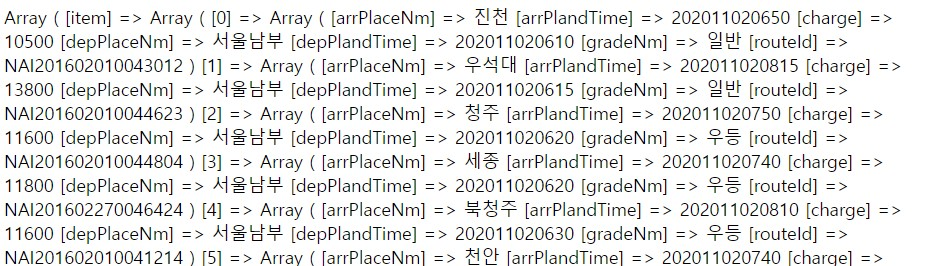
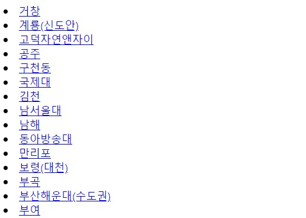

# PHP로 xml 데이터 파싱
'버스타고' 포트폴리오 작업 중 출발지 입력 시 출력되는 도착지 목록을<br/>
공공데이터 API로 불러오고자 한다.

그러나 xml 데이터가 중복되고, 정렬이 되어 있지않아 <br/>
중복값 제거 및 가나다 순으로 정렬하여 가져오고자 한다.
***

## JSON 활용
`simplexml_load_string()` 함수는 xml 데이터를 배열, 오브젝트형식으로 변환해준다.

`<arrPlaceNm>`을 정렬하기 위해서는<br/> <span style="color:yellow">해당 값을 담은 *Array*가 필요</span>하다고 판단하였고,<br/> **JSON**으로 배열을 만들어 코드를 작성하기로 한다.

`$xml = simplexml_load_string($response2);` 이 후 코드

```php
$items = $xml->body->items;

$json = json_encode($items);
$array = json_decode($json,TRUE);

$terminal = $array['item'];
$arrive=array();
foreach($terminal as $key=>$row){
  $arrive[$key]=$row['arrPlaceNm'];
}
array_multisort($arrive, SORT_ASC, $terminal);
print_r($terminal[0]);                  // 출력확인용
print_r($terminal[0]['arrPlaceNm']);    // 출력확인용
echo count($terminal);                  // 전체 데이터 수 확인
$tmn = array();
for($i=0;$i<count($terminal);$i++){
  $arrPlace = $terminal[$i]['arrPlaceNm'];
  array_push($tmn, $arrPlace);
  echo $arrPlace;
}
$tmn = array_unique($tmn);
sort($tmn);
print_r($tmn);

for($a=0;$a<count($tmn);$a++){
  echo "
    <li><a href=\"#\">".$tmn[$a]."</a></li>
  ";
}
```
<br/>

`<items>`안에는 여러 개의 `<item>`이 담겨 있으므로 이를 JSON으로 변환하고,<br/>변환된 $json을 배열로 반환하는 인수인 `TRUE`를 써서 배열을 얻는다.

    $json = json_encode($items);
    $array = json_decode($json,TRUE);


`$array`를 출력하면 다음과 같고 <u>Array > item > Array > Array</u> 구조로 데이터가 존재한다.<br/><br/>


원하는 데이터에 접근하고 정렬하기위해 `$terminal = $array['item']` 할당하고,<br/>`array_multisort()`로 정렬한다.<br/>
JSON 배열은 key:value 형태이기 때문에 정렬하고자하는 key를 선택하여 정렬한다.
```php
$arrive=array();
foreach($terminal as $key=>$row){
  $arrive[$key]=$row['arrPlaceNm'];
}
array_multisort($arrive, SORT_ASC, $terminal);
print_r($terminal);
```
원래 배열(`$termianl`)의 `'arrPlaceNm'`를 포함하는 배열(`$arrive`)을 만든다. 그 후 `array_multisort()`함수를 사용하여 `$terminal` 배열을 기준으로 `$arrive` 배열을 정렬하고. 출력은 정렬된 `$terminal` 배열이다.<br/><br/>

이후로는 정렬된 `'arrPlaceNm'`에 접근하여 중복값을 제거하고 데이터를 출력한다.

```php
$tmn = array();
for($i=0;$i<count($terminal);$i++){
  $arrPlace = $terminal[$i]['arrPlaceNm'];
  array_push($tmn, $arrPlace);
  // echo $arrPlace;
}
$tmn = array_unique($tmn);
sort($tmn);
// print_r($tmn);

for($a=0;$a<count($tmn);$a++){
  echo "
    <li><a href=\"#\">".$tmn[$a]."</a></li>
  ";
```


***

### References
[JSON과 XML 차이점](https://changrea.io/web/jsonandxml/)<br/>
[[PHP] xml을 JSON으로 변환](https://www.delftstack.com/ko/howto/php/php-xml-to-json/)<br/>
[[PHP] array_multisort()함수 사용하여 연관배열 정렬](https://www.delftstack.com/ko/howto/php/how-to-sort-an-array-of-associative-arrays-by-value-of-a-given-key-in-php/)<br/>
***