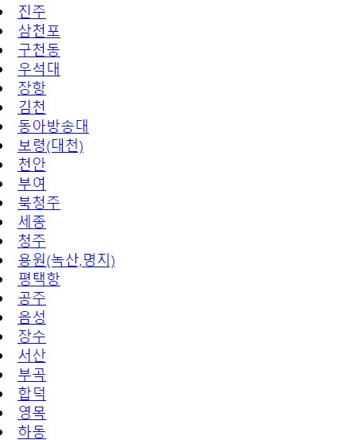

# PHP로 xml 데이터 파싱
'버스타고' 포트폴리오 작업 중 출발지 입력 시 출력되는 도착지 목록을<br/>
공공데이터 API로 불러오고자 한다.

그러나 xml 데이터가 중복되고, 정렬이 되어 있지않아 <br/>
중복값 제거 및 가나다 순으로 정렬하여 가져오고자 한다.
***

## 처음 작성 코드
```php

<?php
  $ch = curl_init();
  // $tId = $_GET[''];
  // $date = $_GET[''];
  $key = "m%2B70sUR8J4J6HiPGJK5mpc9G0CSeZqnr3RWKWzYggEI%2FZlnzrhApBMbxQpy%2BHRBTy3qZdhZGCAaxBHoCtQ1m9w%3D%3D";
  $url = 'http://openapi.tago.go.kr/openapi/service/SuburbsBusInfoService/getTrminlAcctoSuberbsBusInfo'; /*URL*/
  $queryParams = '?'.urlencode('serviceKey').'='.$key;
  $queryParams .= '&' . urlencode('terminalId') . '=' . urlencode('NAI0671801'); /* 출발지 임의값 */
  $queryParams .= '&' . urlencode('depPlandTime') . '=' . urlencode('20201102'); /* 출발일 임의값 */
  $site = $url.$queryParams;
  curl_setopt($ch, CURLOPT_URL, $url . $queryParams);
  curl_setopt($ch, CURLOPT_RETURNTRANSFER, TRUE);
  curl_setopt($ch, CURLOPT_HEADER, FALSE);
  curl_setopt($ch, CURLOPT_CUSTOMREQUEST, 'GET');
  $response = curl_exec($ch);

  $xml = simplexml_load_string($response);
  $num = $xml->body->totalCount;
  $site2 = $site."&numOfRows=".$num;
  curl_setopt($ch, CURLOPT_URL, $site2);
  curl_setopt($ch, CURLOPT_RETURNTRANSFER, TRUE);
  curl_setopt($ch, CURLOPT_HEADER, FALSE);
  curl_setopt($ch, CURLOPT_CUSTOMREQUEST, 'GET');
  $response2= curl_exec($ch);
  $xml = simplexml_load_string($response2);

  $tNmarray = array();
  for ($i=0;$i<sizeof($xml->body->items->item);$i++) {
    $tNm = $xml->body->items->item[$i]->arrPlaceNm;
    array_push($tNmarray, $tNm);
  };

  echo $tNmarray;
  // print_r($tNmarray);
  // echo $tNmarray[0];
  sort($tNmarray);

  for($a=0;$a<count($tNmarray);$a++){
    echo "
        <li><a href=\"#\">".$tNmarray[$a]."</a></li>
      ";
      array_push($array,$tNmarray[$a]);
  }
  echo $array;
?>

```
내가 생각한 코드는
**for문으로 `<arrPlaceNm>`을 가져와 `$tNmarray`에 삽입**하는 것이었다.  <br/>
<br/>

### <span style="color:red"> Error 발생 (Array to string conversion) </span>
```php
$tNmarray = array();
  for ($i=0;$i<sizeof($xml->body->items->item);$i++) {
    $tNm = $xml->body->items->item[$i]->arrPlaceNm;
    array_push($tNmarray, $tNm);
  };
echo $tNmarray;
```
<span style="color:yellow">echo</span> $tNmarray;로 출력하면 다음과 같은 에러가 난다.<br/>
***Notice: Array to string conversion in C:\xampp\htdocs\BUSTAGO\search\AR_terminalselect.php on line 51
Array***

배열은 <span style="color:yellow">print_r</span>로 출력하도록 한다.
```php
print_r($tNmarray);
```
<br/>

#### 출력 구문 비교
```php
$helloArr = ["hello", "my", "world", 1];
$hello = "hello world;
```
||변수|배열
---|---|---
**<span style="color:yellow">echo</span>**|hello world|Array
**<span style="color:yellow">print</span>**|hello world|Array
**<span style="color:yellow">print_r</span>**|hello world|Array([0]=>hello [1]=>my [2]=>world [3]=>1)
**<span style="color:yellow">var_dump</span>**|string(12) "hello world"|Array{[0]=>string(5)"hello" [1]=>string(2)"my" [2]=>string(5)"world" [3]=>int(1)}

<br/>
print_r로 출력 하면<br/>

    Array ( [0] => SimpleXMLElement Object ( [0] => 진천 ) [1] => SimpleXMLElement Object ( [0] => 우석대 ) [2] => SimpleXMLElement Object ( [0] => 청주 ) [3] => SimpleXMLElement Object ( [0] => 세종 ) [4] => SimpleXMLElement Object ( [0] => 북청주 ) [5] => SimpleXMLElement Object ( [0] => 천안 ) [6] => SimpleXMLElement Object ( [0] => 부여 ) [7] => SimpleXMLElement Object ( [0] => 동아방송대 ) [8] => SimpleXMLElement Object ( [0] => 평택항 ) [9] => SimpleXMLElement Object ( [0] => 음성 ) [10] => SimpleXMLElement Object ( [0] => 서산 ) [11] => ...
    ...

이런 배열이 출력된다.<br/>
총 데이터 <u>422개</u>인데, 이 배열에서 중복값을 제거`array_unique()`하고 오름차순 정렬`sort()`을 하고자 한다.
```php
  $ARtmn = array_unique($tNmarray);
  // print_r($ARtmn);
  sort($ARtmn);
  for($a=0;$a<count($ARtmn);$a++){
    echo "
     <li><a href=\"#\">".$ARtmn[$a]."</a></li>
       ";
  }
```
 <br/>
중복값은 제거했지만 정렬이 되지 않는다.

`sort()`가 동작안하나 싶지만 주석처리하면<br/>
리스트 사이에 <span style="color:red">**offset 에러**</span>가 발생하여, 배열 몇 번 요소는 값이 없다고 나온다.<br/>
***Notice: Undefined offset: 12 in C:\xampp\htdocs\BUSTAGO\search\test.php on line 103***

    어떤 배열에서 정의되어 있지 않은 값을 호출하려 할 때 발생하는 에러


아마 중복되어 없는 값의 요소를 offset으로 에러나는 게 아닌가 예상되고,<br/>
`sort()`는 arrPlaceNm이 아닌 내가 인지하지 못한(?) 배열 순을 정렬해주는 것이 아닌가 추정한다.
***

## 관련 코드 검색

PHP로 xml을 파싱하는 방법은 다양한 글들이 있지만,<br/>
추출하고 정렬하는 글은 찾기가 쉽지 않았다.<br/>
그 중 내가 하고자하는 방향과 비슷한 글을 발견하고 실행해보았다.

`$xml = simplexml_load_string($response2);` 이 후 코드

```php
 $items = $xml->body->items;
 $itemArray=array();
  foreach($items->item as $item){
    $dataArray = array(
      'arrPlaceNm' => $item->arrPlaceNm->_toString(),
    )
      array_push($itemArray,$dataArray);
    }
    unsort($itemArray, function($a, $b){
      if($a['arrPlaceNm']==$b['arrPlaceNm']) return 0;
      // return ($a['arrPlaceNm']>$b['arrPlaceNm'])?-1:1;    //내림차순
      return strcmp($a['arrPlaceNm'],$b['arrPlaceNm']);      //오름차순
    });
  print_r($itemArray);
```
xml 구조에서 `<items>`를 가져오고 그 안에 존재하는 `<item>` 각각에 대해<br/>
`<arrPlaceNm>`를 가져와 배열에 담는 거 같다.
밑에 `unsort()`는 정렬 방식을 나타낸다.

코드 실행하면 <span style="color:red">에러 발생</span>한다.<br/>
***Parse error: syntax error, unexpected 'array_push' (T_STRING) in C:\xampp\htdocs\BUSTAGO\search\test.php on line 73***<br/>
해당 오류는 PHP 버전이 낮아서 발생한다고 하는데, 다른 코드를 작성해봐야겠다.

**배열을 가져오는 것부터 잘못된 게 아닌가 추정 중이다.**
***

### References
[[PHP] 출력구문비교](https://m.blog.naver.com/vefe/221454938956)<br/>
[[PHP] xml 데이터 정렬](https://blog.makebyhand.co.kr/420)
***
