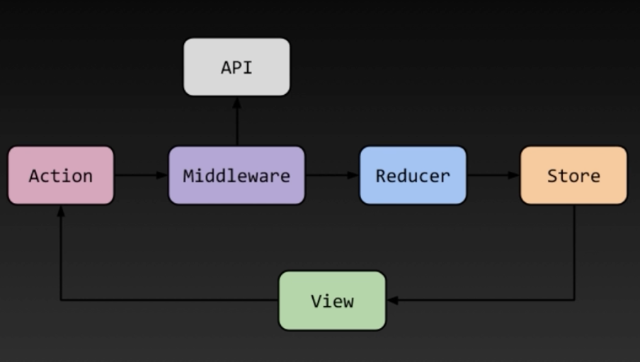

# Redux
상태 관리 라이브러리

꼭 REACT에서만 사용하지 않는다. 하지만 REACT에서 사용할 때 `React-redux`를 설치해서 사용하는 경우가 많다.

## 상태관리가 필요한 이유?
예를 들어 'to do list' app을 만든다고 하면 구조는 다음과 같다.
```
App.js − 할일목록.js
            ⊢ 개별항목.js
            ∟ 입력필드.js
```

하지만 여기서 component가 추가된다면?
```
App.js ⊤ 할일목록.js
       ∣     ⊢ 개별항목.js
       ∣     ∟ 입력필드.js
       ∣
       ∟ 완료한 목록.js
       ∣
       ∟ 삭제목록.js
```
**할일목록.js**에서 `useState`를 사용하여 값을 관리하면 **완료한 목록.js**로 값을 보내기가 어렵다. + 추적하기도 어렵다.

따라서, 전역에서 상태관리를 하기 위해 사용하는 것이 **Redux**이다.<Br/><br/>

> useState와 props

컴포넌트 상태관리
```jsx
const state = {
  todoList: [],
  doneList: [],
  deleteList: [],
}
```

> Redux

글로벌 상태관리 (원하는 component 어디에서든 가져와서 상태를 변경하거나 사용할 수 있다.)

> React-redux

Redux를 React에서 사용하기에 최적화된 라이브러리
```
# Redux 적용 프로젝트 생성

npx create-react-app my-app --template redux
yarn add react-redux
```

## Redux 흐름


`Action`에서 시작해서 `Store`까지 한방향으로 움직인다. (역방향 없음)

1. `Dispatch` 함수를 실행하면,
2. `Action`이 발생한다.
3. 이를 `Reducer`가 전달하면,
4. 최종적으로 `state`를 바꾼다.

### Action
모든 종류의 변화를 일으키는 것을 정의하는 것, 객체를 전달하고 무조건 `type`이라는 값이 들어가야 한다.

### Reducer
매개변수 2개 (상태를 가지고 있는 state와 action) 가진다.<Br/>
실행이 되면 어떤 상태의 action을 실행시켜 변화시킨다.
```jsx
function reducer (state, action) {
  return changeState;
}
```

### Store
앱 전체에서 사용되는 단 하나의 저장소, 현재 상태와 reducer 포함

### Dispatch
Store 내장 함수. Action을 발생시키는 함수
```jsx
dispatch(action)
```