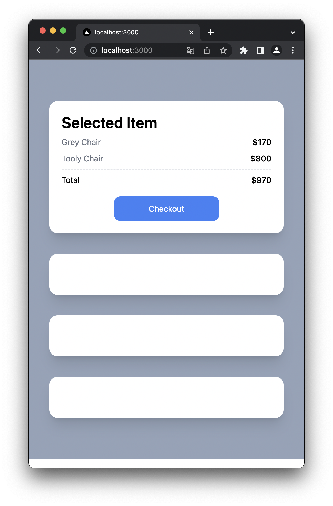
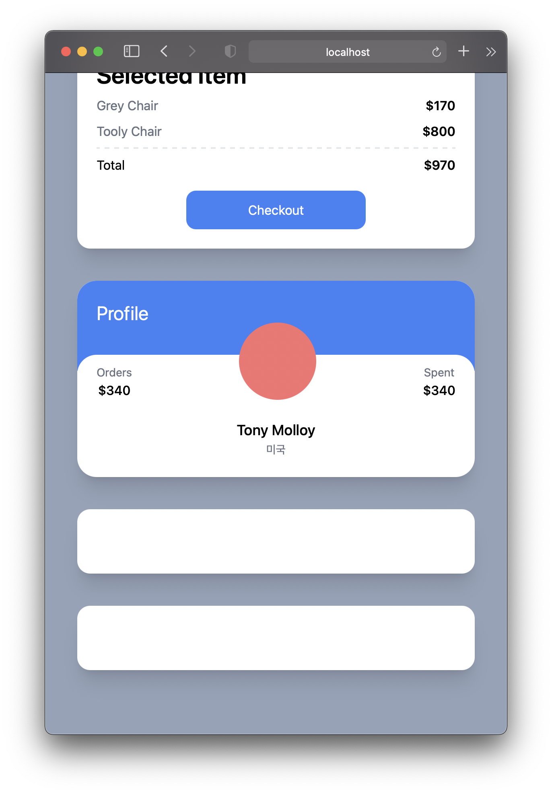
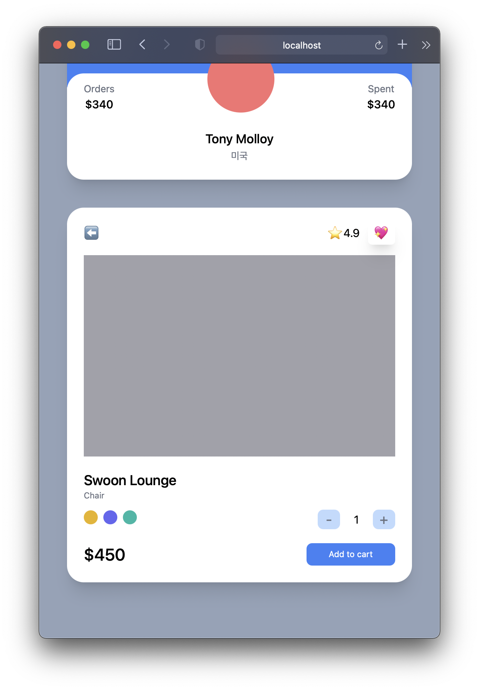

# Tailwind CSS 사용하기

## NextJS 설치
> `npx create-next-app@latest --typescript`

## Tailwind CSS 설치
> `npm install -D tailwindcss postcss autoprefixer`

> `npx tailwindcss init -p`

명령어를 실행하면 **<u>tailwind.config.js</u> / <u>postcss.config.js</u>**이 생성된다.
```js
// tailwind.config.js

module.exports = {
  content: [
    // pages, components의 모든 폴더 안에 다음 확장자를 가지는 모든 파일에서 tailwindCSS를 사용할 것이다.
    "./pages/**/*.{js,jsx,ts,tsx}",
    "./components/**/*.{js,jsx,ts,tsx}"
  ],
  theme: {
    extend: {},
  },
  plugins: [],
}
```
위와 같이 내용을 추가해준다.

> `npm run dev`로 실행한다.

***
## UI 컴포넌트 만들기

### padding
만약 padding을 넣고 싶으면 `p-`뒤에 숫자를 기입한다.

숫자는 0부터 16까지 1씩 증가하다가 16부터는 4씩 증가한다.<br/>
64 이후로는 8씩 증가한다.
> 숫자는 pixel이 아닌 rem 기준이다.

### space
부모요소에 `space-y-5`를 사용하면 모든 자식 요소에 자동으로 **margin-top**과 **margin-bottom**을 준다.
- <u>첫번째 자식요소</u>에는 margin-top이 적용되지 않는다.
- helper class

```tsx
// index.tsx

import type { NextPage } from 'next';

const Home: NextPage = () => {
  return (
    // <div className='bg-slate-400 py-10 px-5 flex flex-col space-y-5'>
    <div className='bg-slate-400 py-20 px-10 grid gap-10'>
      <div className='bg-white p-6 rounded-2xl shadow-xl'>
        <span className='font-semibold text-3xl'>Selected Item</span>
        <div className='flex justify-between my-2'>
          <span className='text-gray-500'>Grey Chair</span>
          <span className='font-semibold'>$170</span>
        </div>
        <div className='flex justify-between'>
          <span className='text-gray-500'>Tooly Chair</span>
          <span className='font-semibold'>$800</span>
        </div>
        <div className='flex justify-between mt-2 pt-2 border-t-2 border-dashed'>
          <span>Total</span>
          <span className='font-semibold'>$970</span>
        </div>
        <div className='mt-5 bg-blue-500 text-white p-3 text-center rounded-xl w-2/4 mx-auto'>Checkout</div>
      </div>
      <div className='bg-white p-10 rounded-2xl shadow-xl'></div>
      <div className='bg-white p-10 rounded-2xl shadow-xl'></div>
      <div className='bg-white p-10 rounded-2xl shadow-xl'></div>
    </div>
  )
};

export default Home
```




## relative
position 위치 지정 가능

## -top
앞에 `-`를 붙이면 위치에 마이너스 값을 줄 수 있다.

```tsx
// index.tsx

import type { NextPage } from 'next';

const Home: NextPage = () => {
  return (
    // <div className='bg-slate-400 py-10 px-5 flex flex-col space-y-5'>
    <div className='bg-slate-400 py-20 px-10 grid gap-10'>
      <div className='bg-white overflow-hidden rounded-3xl shadow-xl'>
        <div className='bg-blue-500 p-6 pb-14'>
          <span className='text-white text-2xl'>Profile</span>
        </div>
        <div className='rounded-3xl p-6 bg-white relative -top-5'>
          <div className='flex items-end justify-between relative -top-16'>
            <div className='flex flex-col items-center'>
              <span className='text-sm text-gray-500'>Orders</span>
              <span className='font-medium'>$340</span>
            </div>
            <div className='bg-red-400 rounded-full h-24 w-24' />
            <div className='flex flex-col items-center'>
              <span className='text-sm text-gray-500'>Spent</span>
              <span className='font-medium'>$340</span>
            </div>
          </div>
          <div className='flex flex-col items-center relative -mt-10 -mb-5'>
            <span className='text-lg font-medium'>Tony Molloy</span>
            <span className='text-sm text-gray-500'>미국</span>
          </div>
        </div>
      </div>
    </div>
  )
};

export default Home
```




```tsx
import type { NextPage } from 'next';

const Home: NextPage = () => {
  return (
    // <div className='bg-slate-400 py-10 px-5 flex flex-col space-y-5'>
    <div className='bg-slate-400 py-20 px-10 grid gap-10 min-h-screen'>
      <div className='bg-white p-6 rounded-3xl shadow-xl'>
        <div className='flex mb-5 justify-between items-center'>
          <span>⬅️</span>
          <div className='space-x-3'>
            <span>⭐️4.9</span>
            <span className='shadow-xl p-2 rounded-md'>💖</span>
          </div>
        </div>
        <div className='bg-zinc-400 h-72 mb-5' />
        <div className='flex flex-col'>
          <span className='font-medium text-xl'>Swoon Lounge</span>
          <span className='text-xs text-gray-500'>Chair</span>
          <div className='mt-3 mb-5 flex justify-between items-center'>
            <div className='space-x-2'>
              <button className="w-5 h-5 rounded-full bg-yellow-500" />
              <button className="w-5 h-5 rounded-full bg-indigo-500" />
              <button className="w-5 h-5 rounded-full bg-teal-500" />
            </div>
            <div className='flex items-center space-x-5'>
              <button className='rounded-lg bg-blue-200 flex justify-center items-center aspect-square w-8 text-xl text-gray-500'>-</button>
              <span>1</span>
              <button className='rounded-lg bg-blue-200 flex justify-center items-center aspect-square w-8 text-xl text-gray-500'>+</button>
            </div>
          </div>
          <div className='flex justify-between items-center'>
            <span className='font-medium text-2xl'>$450</span>
            <button className='bg-blue-500 py-2 px-8 text-center text-xs text-white rounded-lg'>Add to cart</button>
          </div>
        </div>
      </div>
    </div >
  )
};

export default Home
```




## Modifiers
CSS에서 hover 효과를 주려면 `:hover`와 같이 작성했다.<br/>
Tailwind CSS에서는 className에서 `hover:원하는 property`를 작성한다.

`active`, `focus`등 다양한 modifiers가 존재한다.
```tsx
<button className='mt-5 bg-blue-500 text-white p-3 text-center rounded-xl w-2/4 mx-auto 
  hover:bg-teal-500 hover:text-black active:bg-yellow-500 focus:bg-red-500'>Checkout</button>
```