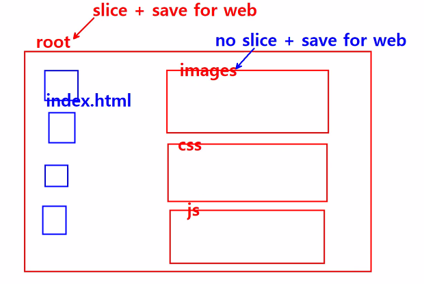

# 디자인한 화면 쪼개기
작성일시: 2021년 9월 9일 오전 10:19

## 웹디자인 이미지 쪼개기

photoshop을 이용하여 웹디자인한 파일을 연다.

보이는 화면에서 text로 대체할 수 있는 부분을 제외한
나머지 부분을 slice tool을 사용하여 조각낸다.

이 때, view-snap 체크를 확인하고
가이드라인을 먼저 개체에 지정한 다은 도구를 사용하면 편하다.

저장은 총 2번한다.

1. 슬라이스 후 그냥 file-save
2. file-export-save for web
여기서 먼저 저장할 부분을 select하고,
어떤 확장자로 저장할 건지 option을 확인하고,
저장 위치는 root폴더에 하지만 이 때 images 폴더가 보여야 한다.

기본 파일 구조 그림